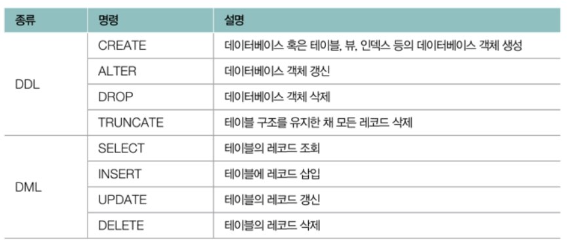
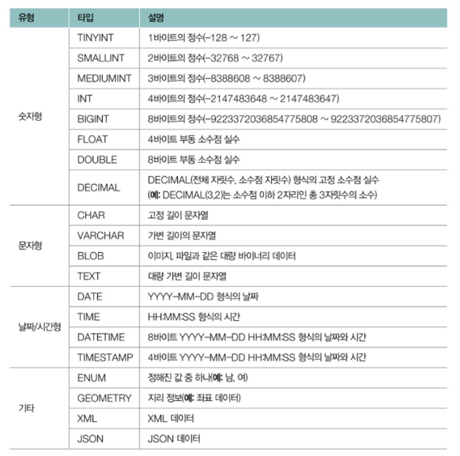
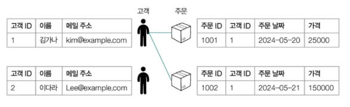
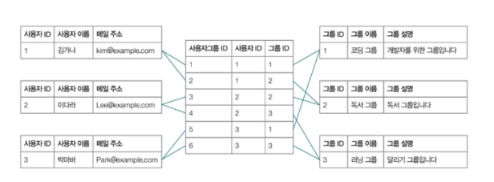
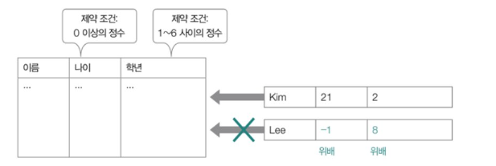

# 1. 데이터베이스의 큰 그림

## 1-1. 데이터베이스와 DBMS

### 1. 데이터베이스

- 사전적 정의 : 여러 사람이 공유하여 사용할 목적으로 체계화해 통합, 관리하는 데이터의 집합
- 데이터의 집합
  - `원하는 기능을 동작시키기 위해 저장해야 하는 정보의 집합`
- 어떤 데이터가 저장되는지에 따라 DB가 활용되는 서비스의 정체성이 달라질 수 있다.
- 또한, 어떻게 저장되느냐 에 따라 서비스의 성능이 달라질 수 있다.

### 2. DBMS(Data Management System)

- 데이터베이스가 중요한 만큼 이를 관리하기 위한 수단
- 데이터베이스 관리 시스템 : `데이터베이스를 관리하기 위한 프로그램`
- 매우 다양한 종류가 있지만, 크게 두 유형으로 나뉜다.
  - RDBMS
  - NoSQL

## 1-2. DBMS의 종류

### 1. 관계형 데이터베이스 관리 시스템 (RDBMS)

- RDBMS 혹은 `관계형 데이터베이스` 라고 한다.
  - Relational DataBase Management System
- 대표적인 예시
  - MySQL, Oracle, PostgreSQL, SQLite, MariaDB, Microsoft SQL Server 등

### 2. NoSQL 데이터베이스 관리 시스템

- NoSQL DBMS 혹은 `NoSQL 데이터베이스` 라고 한다.
- `RDBMS보다 유연한 형태`이다.
  - 따라서, 대규모 데이터를 다루기에 용이하고 확장성이 좋다.
- 대표적인 예시
  - MongoDB, Redis 등

### 3. 그렇다면, 어떤 DBMS를 사용해야 할까?

- 점유율 상으로는 PostgreSQL의 점유율이 49.09%로 가장 높다.
- 하지만, MySQL의 오픈소스 버전인 MariaDB의 점유율과 MySQL의 점유율을 합하면, 58.28%로 가장 높다.
  - 따라서, `RDBMS는 MySQL을 사용`하면 된다.

### 4. DBMS를 다루기 위한 언어 ⭐️⭐️⭐️

- `SQL (Structured Query Language)` 가 대표적인 데이터베이스 언어이다.
- 데이터를 조작, 관리할 수 있는 구조화된 언어이다.
- 종류
  - DDL : 데이터 정의
  - DML : 데이터 조작
  - DCL : 데이터 제어
  - TCL : 트랜잭션 제어
    
  
  

## 1-3. 파일 대신 데이터베이스를 이용하는 이유

- 데이터를 단순히 나열하여 파일에 저장할 경우 한계가 존재한다.

### 1. 파일 시스템의 한계 (단점)

- **데이터 일관성 및 무결성 제공이 어렵다.**
  - 보통 여러 명의 사용자, 프로그램이 동시에 DB를 이용한다.
  - 이때, 레이스 컨디션 문제로 인해 `데이터의 일관성이 훼손되기 쉽다.`
    - `레이스 컨디션(Race Condition)`
      - 여러 프로세스나 사용자가 동시에 같은 데이터에 접근하여 조작할 때 발생할 수 있는 경쟁 상태를 의미
      - 데이터의 일관성을 해칠 수 있는 위험한 상황을 말한다.
  - 또한, 파일에 명시된 데이터에 결함이 없음(=무결함)을 하나하나 검사하기 번거롭다.
    - 즉, `데이터의 무결성을 보장하기 어렵다.`
  - 잘못된 값을 검출하기 어렵다.
- **`불필요한 중복 저장이 많아진다.`**
  - 이미 저장된 정보에 대해 중복 저장되어 `저장 공간 낭비`가 커질 수 있다.
- **데이터 변경 시 `연관 데이터 변경이 어렵다.`**
  - 파일 시스템을 하나 하나 다 확인하여 일일이 모든 데이터를 변경해야 한다.
- **`정교한 검색이 어렵다.`**
  - 보통의 파일 시스템은 문자열 단위로만 검색된다.
  - 특정 조건을 덧붙여 검색하는 경우 파일 시스템은 한계가 존재한다.
- **백업 및 복구가 어렵다.**
  - 많은 사람 및 프로그램이 동시에 이용하기 때문에 백업과 복구 기능을 제공해야 한다.

## 1-4. 데이터베이스의 저장 단위와 트랜잭션

### 1. 데이터베이스의 저장 단위 및 용어들

[https://velog.io/@suker80/day8.-데이터베이스의-차수와-카디널리티](https://velog.io/@suker80/day8.-%EB%8D%B0%EC%9D%B4%ED%84%B0%EB%B2%A0%EC%9D%B4%EC%8A%A4%EC%9D%98-%EC%B0%A8%EC%88%98%EC%99%80-%EC%B9%B4%EB%94%94%EB%84%90%EB%A6%AC%ED%8B%B0)

- `엔티티 (entity)` : 데이터베이스의 저장단위
  - 독립적으로 존재할 수 있는 객체
  - 어떠한 특성을 가진 대상 이라면, 모두 엔티티라고 할 수 있다.
- `속성 (attribute)`: 엔티티의 특성
- `도메인 (domain)` : 엔티티의 속성이 가질 수 있는 값의 집합
- `릴레이션 (relation)` : 엔티티 집합을 이차원 테이블 형태로 나타낸 것 (RDBMS 기준)
  - 컬렉션 (collection) : NoSQL 에서 부르는 엔티티 집합
- `레코드 (record)` : 데이터베이스에 저장된 대상
  - `테이블의 행`
  - 도큐먼트 (document) : NoSQL 에서 부르는 개별 레코드
  - `카디널리티 (cardinality)` : 테이블의 `행의 개수`
- `필드 (field)` : 엔티티 속성
  - `테이블의 열`
  - NoSQL에서는 키의 형태로 나타낸다.
  - `차수 (degree)` : 테이블의 `열의 개수`

### 2. 스키마 (Schema)

- RDBMS와 NoSQL을 구분하는 주요 기준 중 하나
- `데이터베이스에 저장되는 레코드의 구조와 제약 조건을 정의`한 것
  - 따라서, 레코드가 반드시 지켜야 할 틀 이다.
- RDBMS
  - `명확하게 스키마가 정의`된다.
  - 이 스키마로 정해진 테이블의 구조, 필드의 데이터 타입 및 제약 조건을 따라야 한다.
- NoSQL
  - `명확한 스키마가 정의되지 않는다.`
    - 스키마-리스 데이터베이스 라고도 한다.
  - 레코드들의 지켜야 할 구조와 제약 조건에 제한이 없어 RDBMS 보다 자유로운 형태의 레코드를 저장할 수 있다.

## 1-5. 트랜잭션과 ACID

### 1. 트랜잭션 (Transaction)

- `트랜잭션`: 데이터베이스와의 논리적 상호작용의 단위
  - 즉, `DB가 처리하는 작업의 단위` 를 말한다.
- 초당 트랜잭션이라는 지표로 DB의 작업 성능을 나타내기도 한다.
- 단, 트랜잭션은 하나의 쿼리만 포함하는 것이 아니다.
  - 예시)
    - A의 계좌에 돈을 5,000원 입금하기
    - B의 계좌에서 돈을 5,000원 출금하기

### 2. ACID ⭐️⭐️⭐️

- DB는 여러 사용자 및 프로그램이 동시에 사용한다고 했다. → 따라서, 트랜잭션도 동시에 발생할 수 있다.
  - 이때, 안전한 트랜잭션을 보장하기 위해 지켜야 하는 4가지 성질을 ‘ACID’ 라고 한다.
- **원자성 (Atomically)**
  - 하나의 트랜잭션 결과가 모두 성공하거나 모두 실패해야 한다.
  - 트랜잭션이 하나의 단위로 처리되는 것
    - 예를 들어, 입금 시키는 과정이 취소되면 출금 시키는 과정도 취소되어야 한다.
  - All or Nothing
    - 주어진 작업을 모두 성공 or 모두 실패
    - 일부의 성공이나 실패는 존재할 수 X
- **일관성 (Consistency)**
  - 트랜잭션 전후로 DB가 일관된 상태를 유지하는 성질
  - 일관성(일련의 규칙을 지키는 상태)을 깨뜨리지 않는 데이터를 유지하는 성질
  - 단, 트랜잭션 이후 새로운 일관성이 적용될 수 있다.
    - 새로운 일관된 상태가 전이될 수 있다.
    - But, 전이된 경우에도 데이터는 모두 일관된 상태를 유지해야 한다.
- **격리성 (Isolation)**
  - 동시에 수행되는 트랜잭션이 서로 간섭하지 않도록 보장하는 성질
  - 레이스 컨디션 방지
  - 즉, 한 트랜잭션이 어떤 데이터에 접근한 상태라면 다른 트랜잭션은 접근 X
- **지속성 (Durability)**
  - 트랜잭션이 성공적으로 완료된 후에 그 결과가 영구적으로 반영되는 성질
  - 시스템 장애가 발생하더라도 트랜잭션의 결과는 손실되지 않아야 한다.

# 2. RDBMS의 기본

## 2-1. 테이블의 구성: 필드와 레코드

### 1. 필드 타입 과 키

- 필드 타입 : 필드로 사용 가능한 데이터 유형
- 키 : 테이블 내의 특정 레코드를 식별할 수 있는 필드의 집합
  - 테이블 간의 참조에도 사용된다.

### 2. 키의 종류

- `후보키 (Candidate Key)`
  - 테이블의 한 레코드를 식별하기 위한 필드의 최소 집합
  - 하나 이상의 필드로 구성 OK
  - 후보키에 포함된 필드 중 하나라도 생략하면 레코드를 고유하게 식별할 수 X
  - `유일성과 최소성을 모두 만족하는 키`
    - 유일성 : 특정 레코드를 유일하게 식별 OK
    - 최소성 : 최소한의 정보로 레코드를 식별한다.
- `기본키 (Primary Key)`
  - 한 레코드를 식별하도록 선정되어 `테이블당 하나만 존재할 수 있는 키`
  - 여러 후보 키 중 `테이블의 레코드를 대표하도록 선택된 키`
    - 후보키의 일부이다.
      - 따라서, 유일성, 최소성 모두 OK
      - 기본키가 아닌 후보키 → 대체키
  - 특징
    - 중복된 값 X
    - NULL 값 X
    - 반드시 값이 존재해야 한다.
    - 레코드를 구분하기 위한 최소한의 정보로만 이루어져야 한다.
- `외래키 (Foreign Key)`
  - `다른 테이블의 기본키를 참조하는 필드`
    - 테이블 간의 참조 관계를 형성
    - 테이블 간의 관계 표현 OK

## 2-2. 테이블의 관계

- 외래키를 매개로 하는 테이블 간의 연관 관계에 여러 종류가 있다.

### 1. 일대일 대응 관계

- 하나의 레코드가 다른 테이블의 레코드 하나에만 대응되는 경우
  

### 2. 일대다 대응 관계

- 하나의 레코드가 다른 테이블의 여러 레코드와 대응될 수 있는 경우
  - 예시) 내가 주문한 물건을 확인해볼 때, 나 1명에 여러 물건이 있는 경우를 생각해볼 수 있다.
  - 또 다른 예시) 1명의 교수가 여러 과목을 강의하는 경우를 생각해 볼 수 있다.
    

### 3. 다대다 대응 관계

- 한 테이블의 여러 레코드가 다른 테이블의 여러 레코드와 대응되는 경우
  - 예시) 각 사용자가 여러 그룹에 가입할 수 있고, 각 그룹에는 여러 사용자가 속하는 경우
    
- 일반적으로 중간 테이블을 수반한다.
  - 왜?
    - 중간 테이블에 대한 일대다 대응이 2번 이루어진 것과 동일하기 때문이다.
      

## 2-3. 무결성 제약 조건 ⭐️⭐️

- 무결성
  - 일관되며 유효한 데이터의 상태
- 무결성 제약 조건
  - 데이터베이스에 저장된 `데이터의 일관성과 유효성을 유지하기 위해 지켜야 하는 조건`

### 1. 도메인 제약 조건

- 테이블이 가질 수 있는 필드 타입과 범위에 대한 규칙
  - 필드 데이터
    - 원자 값을 가져야 한다.
      - 원자 값 : 더 이상 쪼개질 수 없는 값
    - 지정된 필드 타입을 준수해야 한다.
    - 값의 범위나 기본값이 지정되면 이를 따라야 한다.

### 2. 키 제약 조건

- 레코드를 고유하게 식별할 수 있는 키로 지정된 필드에 중복 값 허용 X

### 3. 엔티티 무결성 제약 조건 (= 기본키 제약 조건)

- 기본키로 지정한 필드는 고유한 값이어야 한다.
- NULL 이 되면, X

### 4. 참조 무결성 제약 조건 (= 외래키 제약 조건)

- 외래키를 통해 다른 테이블을 참조할 때, 데이터의 일관성을 지키기 위한 제약 조건
- 외래키는
  - 참조하는 테이블의 기본키와 같은 값을 가지거나
  - NULL 값을 가져야 한다.

### 5. 참조하는 테이블에서 데이터의 삭제 및 수정 작업이 발생하게 되면 어떻게 될까?

- RDBMS의 경우, 아래의 4가지 작업을 할 수 있다.

1. `연산 제한 (restrict)`
   - 참조하는 테이블에서 데이터의 수정 및 삭제를 막는다.
2. `기본값 설정 (set default)`
   - 참조하는 레코드를 미리 지정한 기본값으로 설정한다.
   - 만약에 데이터가 사라지더라도 NULL 값이 아닌 기본값으로 채우게 된다.
3. `NULL 값 설정 (set null)`
   - 참조하는 레코드를 NULL 로 설정한다.
   - 위와 달리 삭제하게 되면, NULL로 값을 채운다.
4. `연쇄 변경 (cascade)`
   - 참조하는 레코드도 함께 데이터를 수정하거나 삭제한다.
