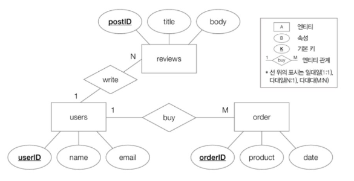
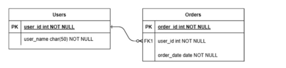
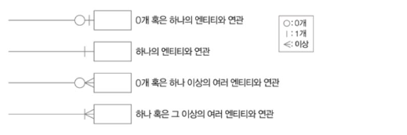
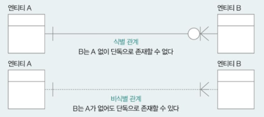
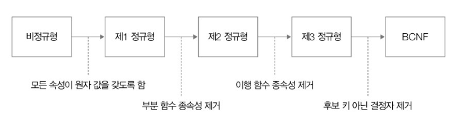
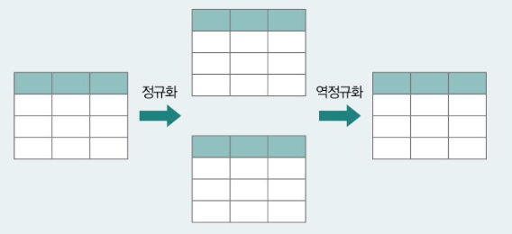
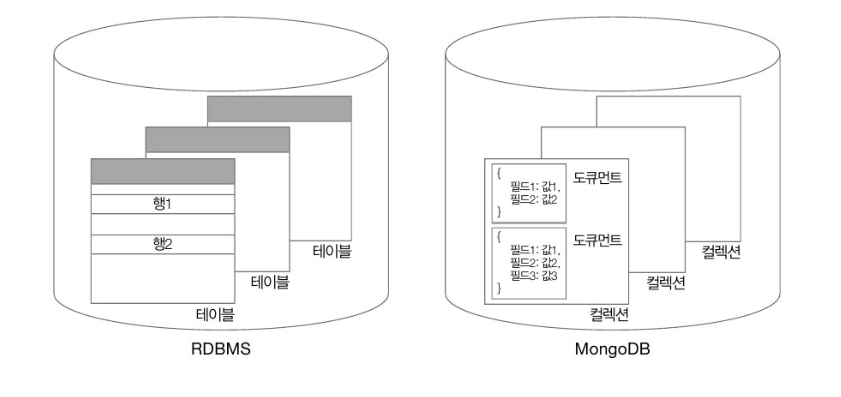
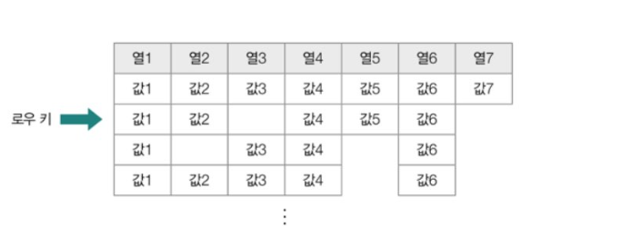
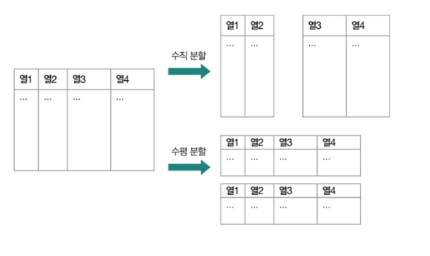
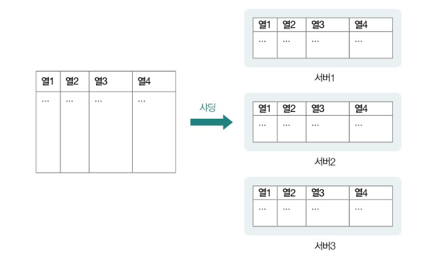

# 1. 데이터베이스 설계

- 엔티티
  - 데이터베이스의 저장 단위
  - 데이터베이스에 저장 가능하며, 다양한 속성을 가진 객체

## 1-1. ER 다이어그램

- ER 다이어그램(이하 ERD)
  - 데이터베이스를 구성하는 요소들의 관계를 나타내는 그림

### 1) 목적

- 데이터베이스에 저장되는 엔티티의 구조를 모델링하는 것
- 데이터베이스로 표현할 대상을 시각적으로 설계하는 것

### 2) 장점

- 추후에 데이터베이스를 확장하거나 수정할 때 어떤 부분이 영향을 받는지 쉽게 파악 OK
- 유지보수가 용이하다.
- 개발자 간 원활한 소통이 가능하다.

### 3) 표기법

- ERD는 종류와 표기법이 매우 다양하다.
- 피터 첸 표기법
  
  - 엔티티를 개념적으로 모델링하는 데는 유용
  - But, 엔티티가 많아질 경우 그림이 다소 복잡해진다.
    - 그리고, RDBMS 상에서 어떻게 테이블의 형태로 표현되는지 한 눈에 파악하기 어려울 수 있다.
- IE 표기법 (Information Engineering notation, 새 발 표기법, 까마귀 발 표기법)
  
  - 오늘날 RDBMS 모델링을 위해 사용하는 ERD 형태
  - 사각형 하나 = 테이블 하나
    - 훨씬 직관적이다.
  - 상단 사각형에 테이블 이름을 작성하고, 사각형 내부에는 속성(필드) 이름을 작성한다.
  - 필드 타입을 함께 명시하기도 하고, 기본 키를 특별히 밑줄 또는 PK로 표기하기도 한다.
    - 외래 키는 따로 FK라고 표기하기도 한다.

### 4) 테이블 간의 관계를 나타내는 표기 ⭐️⭐️⭐️



- 식별/비식별 관계
  
  - 엔티티 간의 연결선을 실선과 점선으로 구분하여 표기하기도 한다.
  - **실선** : `식별 관계`를 의미
    - 식별 관계(identifying replationship)
      - 참조되는 엔티티가 존재해야만 참조하는 엔티티가 존재할 수 있는 관계를 말한다.
      - 예시
        ```sql
        -- 부모 테이블: 고객
        CREATE TABLE Customer (
          customer_id INT PRIMARY KEY,
          name VARCHAR(100)
        );

        -- 자식 테이블: 고객 주소 (고객당 여러 주소 가능)
        CREATE TABLE CustomerAddress (
          customer_id INT,
          address_id INT,
          address VARCHAR(255),
          PRIMARY KEY (customer_id, address_id),
          FOREIGN KEY (customer_id) REFERENCES Customer(customer_id)
        );
        ```
        - `CustomerAddress` 테이블은 `customer_id`를 외래 키로 참조하면서, 동시에 그것이 **기본 키의 일부 ⇒ `식별 관계`**
  - **점선** : `비식별 관계`를 의미
    - 비식별 관계(non-identifying replationship)
      - 참조되는 엔티티가 존재하지 않아도 참조하는 엔티티가 존재할 수 있는 관계를 말한다.
        - 어떤 테이블이 다른 테이블을 외래 키로 참조하긴 하지만, 그 외래 키가 자신의 기본 키에는 포함되지 않는다면, 이는 **비식별 관계이다.**
      - 예시
        ```sql
        -- 부모 테이블: 고객
        CREATE TABLE Customer (
          customer_id INT PRIMARY KEY,
          name VARCHAR(100)
        );

        -- 자식 테이블: 주문
        CREATE TABLE Order (
          order_id INT PRIMARY KEY,
          customer_id INT,  -- 외래 키이지만, 기본 키에는 포함 안 됨
          order_date DATE,
          FOREIGN KEY (customer_id) REFERENCES Customer(customer_id)
        );
        ```
        - `Order` 테이블은 `Customer`를 참조하지만, `customer_id`는 단순히 외래 키일 뿐 **기본 키(order_id)**에는 포함되어 있지 않다. ⇒ `비식별 관계`

## 1-2. 정규화 (Normal Form, NF)

- 하나의 테이블은 어떤 필드로 구성해야 하는 지를 결정하기 위한 작업
- `잠재적인 문제가 발생하지 않도록` 테이블의 `필드를 구성`하고, 필요한 경우 `테이블을 나누는 작업`
  - 일종의 잘 조직된 테이블이 되기 위해 지켜야 하는 `규칙`
- 대부분 제3 정규형, 혹은 보이스/코드 정규형까지만 수행된다.

### 1) 제1 정규형

- 모든 속성이 원자 값을 가진다.
  - 즉, 제1 정규형은 필드 데이터가 더 이상 쪼개질 수 없는 값을 가져야 한다.
    - **중복되는 데이터나 여러 값을 쉼표로 나열하는 등 복합값을 쓰면 안 된다.**
- 예: 1NF 위반

| 학생ID | 이름 | 전화번호                     |
| ------ | ---- | ---------------------------- |
| 1      | 철수 | 010-1111-2222, 010-3333-4444 |

➡ 전화번호에 **여러 개의 값이 들어 있음** → 1NF 위반

- 예: 1NF 만족

| 학생ID | 이름 | 전화번호      |
| ------ | ---- | ------------- |
| 1      | 철수 | 010-1111-2222 |
| 1      | 철수 | 010-3333-4444 |

### 2) 제2 정규형

- 1NF 만족 + 부분적 종속 제거
- 제1 정규형을 만족하는 동시에, 기본 키가 아닌 모든 필드들이 모든 기본 키에 완전히 종속되어 있어야 한다.
- 쉽게 말해,
  - **기본키가 복합키(2개 이상 컬럼)**일 때,
    - **기본키의 일부에만 종속된 속성이 있으면 안 된다.** (→ 이를 제거)
- 부분 함수 종속성
  - 기본 키가 아닌 필드가 기본 키의 일부에 종속되어 있는 경우
- 예: 2NF 위반

| 학생ID | 과목 | 학생이름 |
| ------ | ---- | -------- |
| 1      | 수학 | 철수     |
| 1      | 영어 | 철수     |

➡ 기본키가 `(학생ID, 과목)`인데, `학생이름`은 **학생ID에만 종속**됨 → 부분 종속 → 2NF 위반

✅ 해결 방법

- 학생 테이블과 수강 테이블로 분리

**학생**

| 학생ID | 학생이름 |
| ------ | -------- |
| 1      | 철수     |

**수강**

| 학생ID | 과목 |
| ------ | ---- |
| 1      | 수학 |
| 1      | 영어 |

### 3) 제3 정규형

- 2NF 만족 + 이행적 종속 제거
- 쉽게 말해,
  - A → B → C인 상황에서, **C는 A에 의해 결정되지만 직접이 아니라 B를 거쳐 결정됨**
    - 이런 간접적인(이행적) 종속성을 제거해야 함
- `이행적 종속 관계`가 무엇인지를 이해하는 것이 중요하다!
  - 기본 키가 아닌 모든 필드는 기본 키에 대해
    - `부분 함수 종속성이 없고`, `완전 함수 종속성이 있어`야 한다. ⇒ `2NF`
    - `이행 함수 종속성`이 없어야 한다. ⇒ `3NF`
- 예: 3NF 위반

| 직원ID | 부서ID | 부서이름 |
| ------ | ------ | -------- |
| 1      | 101    | 영업부   |

➡ `직원ID → 부서ID`, `부서ID → 부서이름`

→ 즉, `부서이름`이 **`직접 직원ID`에 종속된 게 아님**, 이행적 종속 존재 → 3NF 위반

✅ 해결 방법

- 부서 테이블을 분리

**직원**

| 직원ID | 부서ID |
| ------ | ------ |
| 1      | 101    |

**부서**

| 부서ID | 부서이름 |
| ------ | -------- |
| 101    | 영업부   |

### 4) 보이스/코드 정규형 (BCNF)

- 3NF를 만족하는 동시에, 모든 결정자가 후보키여야 한다는 조건
  - `결정자` : 특정 필드를 식별할 수 있는 필드를 의미
    - 예) 필드 A가 필드 B를 결정할 경우, (= B가 A에 종속적일 경우) A는 B의 결정자이다.
  - 3NF보다 더 엄격한 조건을 가진다.
- 예: BCNF 위반

| 수업ID | 교수이름 | 강의실 |
| ------ | -------- | ------ |
| A01    | 홍길동   | 101호  |
| A02    | 홍길동   | 101호  |

➡ `교수이름 → 강의실`이고 `수업ID`가 기본키일 때, `교수이름`이 후보키가 아님에도 **결정자 역할** → BCNF 위반

✅ 해결 방법

- 테이블 분해

**교수**

| 교수이름 | 강의실 |
| -------- | ------ |
| 홍길동   | 101호  |

**수업**

| 수업ID | 교수이름 |
| ------ | -------- |
| A01    | 홍길동   |
| A02    | 홍길동   |

### 정규화 요약 정리



| 정규형 | 조건                       | 주요 개념                        |
| ------ | -------------------------- | -------------------------------- |
| 1NF    | 모든 컬럼은 원자값         | 중복, 복합값 제거                |
| 2NF    | 1NF + 부분적 종속 제거     | 복합키 일부에만 의존한 속성 제거 |
| 3NF    | 2NF + 이행적 종속 제거     | 간접 종속 제거                   |
| BCNF   | 3NF + 모든 결정자는 후보키 | 더 강한 형태의 3NF               |

### 역정규화

- `검색 속도를 높이기 위해` 분할되어 있는 `테이블을 하나로 합치는 작업`
- 정규화가 무조건으로 최선인 것은 아니다.
- 정규화를 거듭하다 보면 테이블이 쪼개지는 경향이 있다.
  - 이렇게 테이블이 많아지면, `조인 연산이 많아지고`, `다른 테이블을 참조하기 위한 성능 상의 비용`이 증가할 수 있다.
  - 즉, 데이터는 깔끔하게 정돈되고 이상현상이 줄어드는 것은 맞지만,
    - 오히려 성능을 저해할 수도 있다.
- 성능상의 이점을 위해 가급적 하나의 테이블로 데이터를 관리하기도 한다.
  - NoSQL은 기본적으로 정규화를 하지 않는다.



# 2. NoSQL

- **NoSQL**은 `"Not Only SQL"`의 줄임말
- **전통적인 관계형 데이터베이스(RDBMS)가 아닌 방식으로 데이터를 저장하고 관리**하는 시스템을 의미
- **`비정형/반정형 데이터`**, **`대용량 처리`**, **`유연한 스키마`**, `확장성`이 좋아 최근 많이 사용한다.
- `높은 부하를 감당하거나 대용량 데이터를 다루는 분산 환경` 에서 유용하게 사용될 수 있다.
  - 따라서, 성능을 위해 ACID와 정규화를 엄격히 준수하진 않는다.
  - 때문에 RDBMS에 비해 데이터 무결성과 일관성이 다소 저하될 수 있지만, 큰 성능 향상을 얻을 수 있다.
    - 아예 지원하지 않는 것은 아니고, 경우에 따라 옵션으로 지원한다.

### NoSQL 이 RDBMS를 완전히 대체할 수 있을까?

- NO
  - ACID에 대한 엄격한 준수나 데이터의 무결성, 일관성 유지가 중요한 환경 ⇒ RDBMS 가 더 적합!
  - 또한, 저장할 데이터 비교적 정형화되어 있거나 확장성을 크게 염두하고 있지 않다면 굳이 가용성에 중점을 두고 비정형화된 형태를 다루는 NoSQL을 사용할 이유가 없다.

## 2-1. RDBMS vs NoSQL : NoSQL 의 특징

- RDBMS와 달리 레코드를 다양한 형태로 저장 가능하다.
- SQL 이외의 방법으로 저장된 데이터도 다룰 수 있다.
- 대표적으로 4가지 있다.
  - 키-값 데이터베이스
  - 도큐먼트 데이터베이스
  - 그래프 데이터베이스
  - 칼럼 패밀리 데이터베이스

### 1) 키-값 데이터베이스

- 데이터베이스에 레코드를 키와 값의 쌍으로 저장
  - 레코드 구조가 단순히 키-값
    - 이 특성상 레코드를 보조기억장치가 아닌 `메모리에 저장`해 `빠른 데이터베이스 접근` 속도를 제공하기도 한다. ⇒ `인메모리 데이터베이스` 라고 한다.
- 가장 간단한 형태의 NoSQL 데이터베이스 유형
- `Redis`, Memcached 등이 대표적
- 캐시나 세션 등 `가벼운 정보를 저장`하는 경우가 많다.

### 2) 도큐먼트 데이터베이스

- 레코드를 `도큐먼트` 라는 단위로 저장하고 관리
- `도큐먼트` : 정형화되어 있지 않은 NoSQL 레코드의 단위 를 통칭하기 위해 사용하는 용어
  - JSON, XML과 같은 형식을 도큐먼트로 활용함.
- `MongoDB` 가 대표적



- 하나의 레코드를 JSON 형태의 데이터로 만들어서 관리한다.
- JSON의 키 = 필드, 데이터 하나 하나가 RDBMS의 행
  - 정확히는 `BSON(Binary JSON)` 이라고 한다.
  - 형태는 JSON과 동일하다.
- 고정된 스키마가 없기 때문에 각 도큐먼트가 다음 그림과 같이 유연한 스키마를 가질 수 있다.
- `컬렉션` : 도큐먼트가 모인 것
  - 컬렉션이 모여서 데이터베이스를 이룬다.

### 3) 그래프 데이터베이스

- 그래프의 노드 형태로 저장하는 데이터베이스
- `neo4j`가 대표적
- 방향 그래프를 표현하기 위해 활용된다.
- 노드 간의 연결 관계와 방향을 표현할 수 있어서 `SNS의 친구 관계` 나 `교통망` 같이 데이터 간의 관계성이 중요한 레코드를 저장하기 위해 주로 사용된다.

### 4) 칼럼 패밀리 데이터베이스

- 행, 열이라는 개념이 존재한다.
- `로우 키(row key)` 를 통해 특정 행을 식별한다.
- 다만, `정규화` 나 `조인` 을 사용하지 않는다.
- 스키마가 고정되어 있지 않아 자유롭게 열을 추가할 수 있다.
  - 따라서, 행과 열의 집합이 반드시 엄격한 테이블의 형태를 이루지는 않는다.
  - 동적으로 변할 수 있는 열들이 있고, 거기에 행 데이터들이 대응되어 있는 것에 가깝다.



- `칼럼 패밀리` : 관련 있는 열들이 모인 단위
- `키스페이스` : 여러 칼럼 패밀리들을 포괄하는 단위, 칼럼 패밀리 데이터베이스의 `최상위 단위` 이다.
  - 일반적으로는 애플리케이션마다 키스페이스가 하나씩 사용된다.

# 3. 데이터베이스 분할과 샤딩

- `데이터베이스 분할 (데이터 파티셔닝)`
  - 안정적이고 확장성 높은 데이터베이스 레코드 관리를 위해 테이블을 물리적으로 분할하여 레코드를 저장하는 기술
  - 파티셔닝 : 분할되어 저장하는 단위



- `수평적 분할` : 테이블의 `행` 을 기준으로 테이블을 나누어 저장하는 방식
- `수직적 분할` : 테이블의 `열` 을 기준으로 테이블을 나누어 저장하는 방식

## 3-1. 수평적 분할 방법 4가지

### 1) 범위 분할

- 레코드 데이터가 가질 수 있는 범위를 정의하고, 해당 범위를 기준으로 테이블을 나눈다.

### 2) 목록 분할

- 레코드 데이터가 특정 목록(리스트)에 포함된 값을 가질 경우 해당 레코드를 별도의 테이블로 분할한다.

### 3) 해시 분할

- 특정 열 데이터에 대한 해시 값을 기준으로 별도의 테이블로 분할한다.
  - 즉, 파티션별 레코드가 해시 값을 기준으로 균등하게 분배된다.

### 4) 키 분할

- 키를 기준으로 별도의 테이블로 분할한다.
  - 즉, 파티션별 레코드가 키를 기준으로 균등하게 분배된다.
  - 분할된 테이블을 조회할 때, 특정 레코드가 속한 파티션의 식별은 파티셔닝 키로 이루어진다.
    - 테이블의 열을 기준으로 파티셔닝 키가 만들어진다.

## 3-2. 샤딩

- 파티션이 동일한 데이터베이스 서버 내에 위치하면, 부하 분산을 기대하기 어렵다.
  - 따라서, 특별한 수평적 분할 기술인 `샤딩` 이 사용된다.
- `샤딩` : 분할된 테이블을 별개의 데이터베이스 서버에 분산하여 저장하는 기술
- `샤드` : 분할되어 저장된 단위
- 이렇게 되면, 분할된 샤드들은 `여러 서버에 분산되어 저장` 되기 때문에 `부하 분산 효과` 를 얻을 수 있다.


