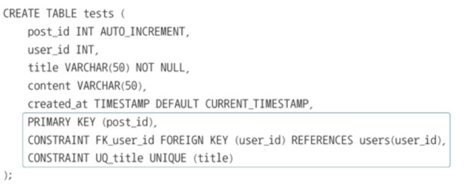
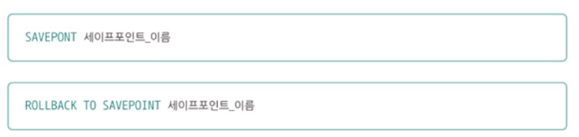
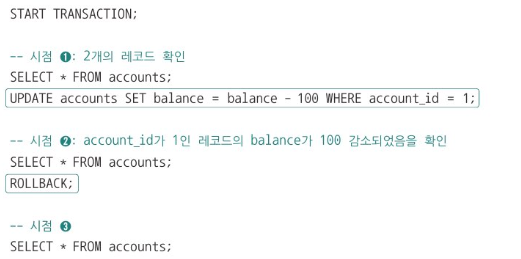
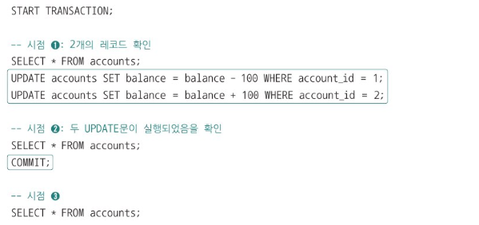
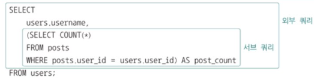
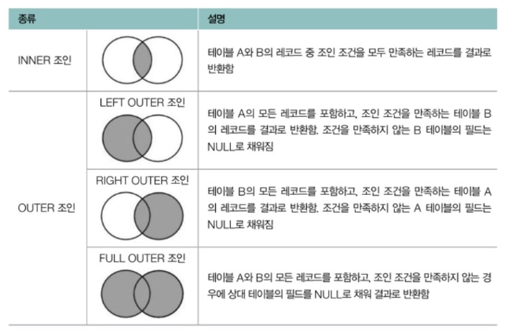
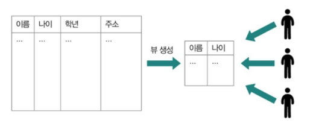
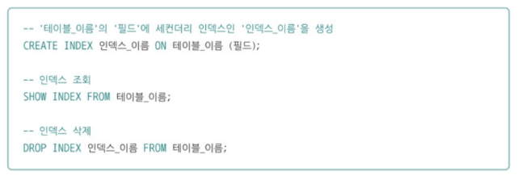

# 1. SQL

- RDBMS 에서는 SQL 명령을 크게 DDL, DML, DCL(데이터 제어 언어), TCL로 나누고 있다.
- 이 중 자주 언급되는 DDL, DML, TCL 위주로 알아보자.
- 주의할 점
  - SQL 문의 끝을 표기하기 위해 세미콜론 기호(\;) 를 사용해야 한다.
  - 문장 끝마다 세미콜론을 붙여야 한다.

## 1-1. 데이터 정의 언어 (DDL)

- 데이터 정의를 위한 SQL
- DDL (Data Definition Language)

| 종류                                         | 설명                                     |
| -------------------------------------------- | ---------------------------------------- |
| CREATE                                       | DB 혹은 DB 객체 생성                     |
| ALTER                                        | DB 객체 생성                             |
| (예: 테이블에 필드 및 제약 조건을 추가/삭제) |
| DROP                                         | DB 객체 삭제                             |
| TRUNCATE                                     | 테이블 구조를 유지한 채 모든 레코드 삭제 |

- 데이터베이스 객체
  - 데이터베이스에서 정의될 수 있는 대상을 통칭하는 용어
  - 대표적인 예
    - 테이블
    - 인덱스
    - 뷰

### 1. CREATE

- 데이터베이스, 테이블, 뷰, 인덱스, 사용자 등 다양한 대상을 정의한다.

<aside >

```
CREATE [정의할 대상(ex. DATABASE, USER, TABLE)] [대상 이름];
```

</aside>

- 데이터베이스, 테이블의 조회 및 사용
  - `SHOW DATABASES;` 라는 명령을 통해 현재 데이터베이스를 확인할 수 있다.
    - `SHOW TABLES FROM 데이터베이스_이름;` 을 통해 데이터베이스에 속한 전체 테이블을 확인할 수 있다.
  - `DESCRIBE(DESC) 테이블_이름;` 을 통해 `테이블의 구조` 를 확인할 수 있다.

```java
CREATE TABLE 테이블_이름 (
		필드_이름1 필드1_타입,
		필드_이름2 필드2_타입,
		필드_이름3 필드3_타입,
		...
);
```

- `필드 타입` 의 우측 혹은 `CREATE TABLE` 문 하단에 키워드를 통해 특정 필드가 지켜야 할 제약 조건을 명시할 수 있다.
  | 키워드 | 제약 조건 |
  | -------------- | ---------------------------------------- |
  | PRIMARY KEY | 특정 필드를 기본 키로 지정 |
  | UNIQUE | 특정 필드가 고유한 값을 갖도록 설정 |
  | FOREIGN KEY | 특정 필드를 외래 키로 지정 |
  | DEFAULT 기본값 | 기본값 지정 |
  | NULL/NOT NULL | 특정 필드에 NULL 값을 허용/허용하지 않음 |
- 선택적으로 제약 조건에 이름을 붙여 줄 수도 있다.
  

### 2. ALTER

- CREATE TABLE 문을 통해 생성된 테이블에 `새로운 필드를 추가` 하거나 `기존의 필드를 수정/삭제` 할 수 있다.
  - 제약 조건도 새롭게 추가, 수정, 삭제할 수 있다.
- 적용 대상
  - 테이블, 뷰, 인덱스 등에도 적용 가능하다.

```sql
-- 새로운 필드 추가 (ADD)
-- ALTER TABLE 테이블_이름 ADD COLUMN 필드_이름 필드_타입 [제약 조건]
ALTER TABLE posts ADD COLUMN new_field VARCHAR(50) NOT NULL;

-- 기존 필드 수정 (CHANGE)
-- ALTER TABLE 테이블_이름 CHANGE COLUMN 기존_필드_이름 새_필드_이름 필드_타입 [제약 조건]
ALTER TABLE posts CHANGE COLUMN new_field old_field VARCHAR(30) NOT NULL;

-- 기존 필드 삭제 (DROP)
-- ALTER TABLE 테이블_이름 DROP COLUMN 필드_이름
ALTER TABLE posts DROP COLUMN old_field;

-- 외래 키 제약 조건 추가 (ADD FOREIGN KEY ~ REFERENCES)
-- ALTER TABLE 테이블_이름 [ADD CONSTRAINT 제약_조건_이름]
		-- ADD FORIGN KEY (필드_이름) REFERENCES 참조_테이블_이름(참조_필드)
ALTER TABLE posts ADD FOREIGN KEY (user_id) REFERENCES users(user_id);

-- UNIQUE 제약 조건 추가
-- ALTER TABLE 테이블_이름 MODIFY 필드_이름 필드_타입 NOT NULL
ALTER TABLE users MODIFY email VARCHAR(100) NOT NULL;

-- 기본키 설정 (PRIMARY KEY로 사용 중인 필드가 없을 경우)
-- ALTER TABLE 테이블_이름 ADD PRIMARY KEY (필드_이름)
ALTER TABLE posts ADD PRIMARY KEY (post_id);
```

### 3. DROP

- 테이블이나 데이터베이스를 삭제할 수 있다.

```sql
DROP DATABASE 데이터베이스_이름;
DROP TABLE 테이블_이름;
```

- 적용 대상 : 데이터베이스, 테이블, 뷰, 인덱스 등 적용 가능

### 4. TRUNCATE

- 테이블의 `구조를 유지한 채`로 `테이블의 모든 레코드를 삭제`한다.
  - 따라서, `DESC` 명령어를 통해 테이블을 확인할 수 있다.
- DROP vs TRUNCATE

| 구분        | DROP                   | TRUNCATE                            |
| ----------- | ---------------------- | ----------------------------------- |
| 목적        | 테이블 **자체를 삭제** | 테이블의 **데이터만 삭제**          |
| 테이블 구조 | **완전히 제거됨**      | **유지됨** (컬럼, 제약조건 등 남음) |
| 데이터 복구 | **불가능**             | 일반적으로 **불가능** (로그 최소화) |

- `DROP TABLE 테이블명;` → **테이블 자체 제거**
- `TRUNCATE TABLE 테이블명;` → **데이터만 삭제하고 테이블 구조 유지**

<br/>

## 1-2. 데이터 조작 언어 (DML)

- 데이터 조작을 위한 SQL
- DML (Data Manipulation Language)

| 종류   | 설명                 |
| ------ | -------------------- |
| SELECT | 테이블의 레코드 조회 |
| INSERT | 테이블의 레코드 삽입 |
| UPDATE | 테이블의 레코드 수정 |
| DELETE | 테이블의 레코드 삭제 |

### 1. SELECT

- 가장 중요한 SQL문 중 하나
  - 가장 자주 사용된다.
- 삽입된 레코드를 조회하는 명령어이다.
- 테이블 내 레코드를 다양하게 정렬하거나 필터링하여 조회하는 것도 가능

- 기본 문법

  ```sql
  SELECT 필드1, 필드2, ...
  		FROM 테이블_이름
  		WHERE 조건식
  		GROUP BY 그룹화할_필드
  		HAVING 필터_조건
  		ORDER BY 정렬할_필드
  		LIMIT 레코드_제한
  ```

  - 필드에 `*` 가 사용되는 경우, `모든 필드` 를 의미한다.

<br/>

#### 패턴 검색과 연산/집계 함수

- SELECT 문은 패턴 검색이나 연산/집계 함수와 함께 사용되는 경우가 많다.
- 패턴 검색이란?

  - 문자열 데이터에서 특정 패턴을 찾는 기능
  - `LIKE` 연산자 와 와일드카드 문자인 `%`, `_` 를 사용해 패턴 검색을 수정할 수 있다.
    | 와일드카드 | 의미 | 예시 설명 |
    | ---------- | ---------------------------- | ---------------------------------------- |
    | `%` | **0개 이상의 문자**와 일치 | `'a%'` → `a`로 시작하는 모든 문자열 |
    | `_` | **정확히 1개의 문자**와 일치 | `'a_'` → `a`로 시작하고 두 글자인 문자열 |
  - 사용 예시

    - `%` 와일드카드 예시

      ```sql
      -- 'Kim'으로 시작하는 이름 찾기
      SELECT * FROM users
      WHERE name LIKE 'Kim%';
      -- Kim, Kimura, Kimberly, Kim123 등과 일치

      -- 'son'으로 끝나는 이름 찾기
      SELECT * FROM users
      WHERE name LIKE '%son';
      -- Johnson, Jackson, Emerson 등과 일치

      -- 'an'이 포함된 이름 찾기
      SELECT * FROM users
      WHERE name LIKE '%an%';
      -- Jane, Andy, Hannah, Brandon 등
      ```

    - `_` 와일드카드 예시

      ```sql
      -- 첫 글자가 'J'이고, 두 번째 문자는 아무 글자, 세 글자 이름
      SELECT * FROM users
      WHERE name LIKE 'J__';
      -- Joe, Jim, Jay 등

      -- 세 글자 이름, 가운데 글자가 'i'인 사람
      SELECT * FROM users
      WHERE name LIKE '_i_';
      -- Kim, Bin, Liz, Min 등
      ```

<br/>

#### 연산/집계 함수

- `GROUP BY`와 함께 사용하면 **그룹별 통계**도 낼 수 있다.

| 함수명    | 설명                           | 예시 결과 예측             |
| --------- | ------------------------------ | -------------------------- |
| `COUNT()` | 행의 개수를 반환 (NULL은 제외) | `5` (행이 5개 있으면)      |
| `SUM()`   | 숫자형 컬럼의 **합계** 반환    | `10000` (급여 합 등)       |
| `AVG()`   | 숫자형 컬럼의 **평균값** 반환  | `2000.0`                   |
| `MAX()`   | 최댓값 반환                    | `3000` (가장 높은 급여 등) |
| `MIN()`   | 최솟값 반환                    | `1000` (가장 낮은 급여 등) |

<br />

#### 유용하게 사용되는 다양한 절들

| 절 (Clause) | 설명                                          | 주요 용도                                           | 위치 순서 (SQL 문장 내)     |
| ----------- | --------------------------------------------- | --------------------------------------------------- | --------------------------- |
| `GROUP BY`  | 행을 그룹화                                   | 집계 함수(`SUM`, `COUNT`, `AVG` 등)와 함께 사용     | `FROM` 다음, `WHERE` 다음   |
| `HAVING`    | `GROUP BY`로 묶인 **그룹에 대한 조건 필터링** | 집계 결과에 조건을 줄 때 사용                       | `GROUP BY` 다음             |
| `ORDER BY`  | 조회 결과를 **지정한 컬럼 기준으로 정렬**     | 오름차순(`ASC`, 기본값), 내림차순(`DESC`) 지정 가능 | `SELECT` 절의 마지막에 위치 |
| `LIMIT`     | 결과 행 수를 **제한**                         | 예: 상위 10개 행만 보기                             | `ORDER BY` 다음             |

<br />

#### 실행 순서

```

FROM → WHERE → GROUP BY → HAVING → SELECT → ORDER BY → LIMIT
```

- 실행 순서에 유의하지 않으면 다수의 레코드를 조회할 때 간혹 `예기치 못한 성능 저하`가 발생 하거나 `의도하지 않은 결과`를 얻게 될 수도 있다.

<br />

### 2. INSERT

- 테이블에 **새로운 데이터를 추가**할 때 사용한다.
- `NOT NULL`, `PRIMARY KEY`, `DEFAULT` 등의 제약 조건을 충족해야 정상적으로 삽입된다.
- 기본 문법
  ```sql
  INSERT INTO 테이블명 (컬럼1, 컬럼2, ...)
  VALUES (값1, 값2, ...);
  ```

<br />

### 3. UPDATE

- 테이블에 존재하는 **데이터의 일부를 수정**할 때 사용한다.
- 반드시 `WHERE` 조건절을 사용하여 **수정 대상**을 명확히 지정하는 것이 중요하다.
  - `WHERE`절을 생략하면 **테이블의 모든 행이 수정된다.**
- 기본 문법
  ```sql
  UPDATE 테이블명
  SET 컬럼1 = 값1, 컬럼2 = 값2, ...
  WHERE 조건;
  ```
  <br />

### 4. DELETE

- 테이블에서 **기존 데이터를 삭제**할 때 사용한다.
- `테이블 구조는 그대로 유지`되며, 행(row)만 사라진다.
  - `WHERE`절 없이 실행하면 **모든 데이터가 삭제된**다.
- 기본 문법
  ```sql
  DELETE FROM 테이블명
  WHERE 조건;
  ```

<br />

## 1-3. 트랜잭션 제어 언어 (TCL)

- 트랜잭션을 제어하는데 사용
- 트랜잭션이란?
  - 하나의 작업 단위를 의미한다.
  - DB에서는 일련의 작업들을 하나의 묶음으로 처리하여 전부 성공하거나 전부 실패하게 만드는 것이 핵심이다.

| 종류      | 설명                      |
| --------- | ------------------------- |
| COMMIT    | 데이터베이스에 작업 반영  |
| ROLLBACK  | 작업 이전의 상태로 되돌림 |
| SAVEPOINT | 롤백의 기준점 설정        |

- 여러 작업을 포함하는 트랜잭션을 나타낼 때는 `START TRANSACTION`or `BEGIN` 명령을 사용한다.
  - 이는 DBMS에 이제부터 트랜잭션이 시작됨을 알리는 명령이다.
    

| 명령어      | 기능                | 실행 시점                   | 주의사항                          |
| ----------- | ------------------- | --------------------------- | --------------------------------- |
| `COMMIT`    | 변경 사항 영구 저장 | 트랜잭션 완료 시            | 이후 ROLLBACK 불가능              |
| `ROLLBACK`  | 전체 변경 사항 취소 | 오류 발생 또는 수동 취소 시 | COMMIT 전까지만 가능              |
| `SAVEPOINT` | 중간 지점 설정      | 트랜잭션 중간               | 여러 개 설정 가능, 이름 지정 필요 |

<br/>

- SAVEPOINT : ROLLBACK으로 되돌아갈 시점을 지정하는 기능
  
  - 세이프포인트\_이름 으로 지정
  - 지정된 세이프포인트\_이름으로 되돌아가는 명령
    <br />
- 트랜잭션 예시 1
  
  - 커밋을 하지 않았으므로, 1의 상태와 같다.
    <br />
- 트랜잭션 예시 2
  
  - 커밋으로 반영하였으므로, 모든 작업이 반영된 상태이다.
    <br />
- DDL은 MySQL의 공식 문서에 따르면, 자동 커밋이 기본으로 켜져 있다.
  - 단, START TRANSACTION or BEGIN을 실행하면 자동 커밋이 꺼진 상태로 실행된다.
  - 즉, 직접 COMMIT or ROLLBACK을 만나기 전까지는 커밋되지 않는다.
  - `SET autocommit=0;` : 자동 커밋 기능 끄기 (1: 자동 커밋 켜기)

<br />

---

# 2. 효율적 쿼리

## 2-1. 서브 쿼리와 조인

- 여러 테이블에 질의하는 등 복잡한 요청을 해야 할 때 유용하게 사용된다.
- 서브 쿼리란?
  - 다른 SQL문이 포함된 SQL문을 의미한다.
    
- 조인이란?
  - 2개의 테이블을 하나로 합치는 것을 의미한다.



<br/>

## 2-2. 뷰

- **하나 이상의 테이블을 기반으로 만들어진 `가상의 테이블`**
- 실제 데이터를 가지지 않고 **SELECT 문 결과를 논리적으로 표현**
- 마치 테이블처럼 `SELECT`, `JOIN` 등의 쿼리에서 사용 가능
- 주로 **복잡한 쿼리의 `단순화`**, **보안**, **재사용성 향상** 등의 목적으로 사용
  - 또한, 특정 사용자에게 테이블의 특정 데이터만을 보여주고자 할 때도 사용할 수 있다.
    

### 기본 문법

```

CREATE VIEW 뷰_이름 AS SELECT문;
```

- 삭제 명령 → `DROP VIEW`

### 유의할 점

- SELECT (조회)에는 제한 X
- INSERT, UPDATE, DELETE 등은 불가능할 수도 있다.
  - 왜?
    - 여러 테이블을 조회한 결과로 만들어졌기 때문에, 삽입/수정/삭제 연산의 경우 테이블의 제약 조건을 쉽게 어기게 될 수 있기 때문이다.
- 따라서, 뷰는 조회를 목적으로 사용되는 경우가 많다.
  <br/>

## 2-3. 인덱스

- RDBMS의 성능을 향상시키는 가장 대중적인 방법이다.
- 적재적소에 활용하면 성능상의 이점을 얻을 수 있지만, 반대로 `남용하게 되면 오히려 성능에 악영향`을 끼치기도 한다.

### 종류

- 클러스터형 인덱스와 세컨더리 인데스로 구분된다.

#### 1. 클러스터형 인덱스 ⇒ 기본키

- 데이터 자체가 인덱스 순서에 따라 정렬되어 저장된다.
- 테이블당 하나만 존재
- 기본키로 지정된 필드는 기본적으로 클러스터형 인덱스로 간주된다.
  - 만약, 기본키로 지정된 필드가 없는 경우에는 NOT NULL 제약 조건과 UNIQUE 제약 조건이 있는 필드를 클러스터형 인덱스로 간주한다.

#### 2. 세컨더리 인덱스(논클러스터형 인덱스)

- 테이블 당 여러개 존재 OK
- 클러스터형 인덱스를 활용한 검색보다 일반적으로 느리다.



- 위의 명령으로 세컨더리 인덱스를 생성하고 조회, 삭제할 수 있다.

- 모든 필드에 대해 인덱스를 생성하지 않는 이유는?
  - 기회비용이 존재한다.
    - 인덱스의 저장 공간과 생성 시간을 고려해야 한다.
    - 엄연히 자료구조이므로 차지하는 공간이나 생성 시간이 데이터가 추가됨에 따라 점점 커질 수 있다.
  - 따라서, 데이터가 충분히 많지 않은 상황에서는 굳이 인덱스를 사용할 필요가 없다.
    - (+) `조회 연산이 적은 경우` / `삽입, 수정, 삭제 연산이 많은 경우` 에는 `굳이 인덱스가 필요 없다.`
    - 즉, 인덱스는 데이터가 충분히 많은 테이블, 조회가 빈번히 이루어지는 테이블 필드에 만들어 활용하는 것이 좋다.
      - TIP) SELECT문 중에서도 `자주 조인`되거나 `WHERE, ORDER BY 에서 자주 언급되는 필드`가 인덱스로 활용되기 좋다.
  - 일반적으로 테이블당 3개 이하의 인덱스를 권고한다.
