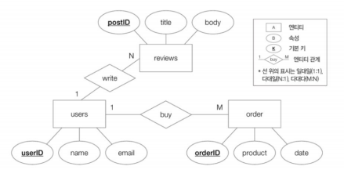
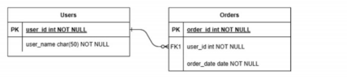
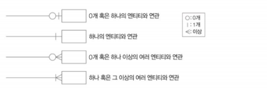
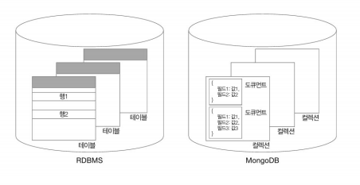

# [ 3주차 | DB | JSY ]

# 📝데이터베이스

## 6.5 데이터베이스 설계

### ER 다이어그램

ER다이어그램은 엔티티 관계를 표현하는 모델로 실세계의 데이터를 시각적으로 모델링하기 위해 사용하는 다이어그램이다.

## ✅ ER 다이어그램의 주요 구성 요소

## 1. **엔터티(Entity)**

- **정의**: 독립적으로 존재할 수 있는 객체(사람, 장소, 사물, 개념 등).
- **표현**: **직사각형**으로 표현함.
- **종류**:
  - **강한 엔터티**: 기본 키를 가지며 독립적으로 존재 가능.
  - **약한 엔터티**: 기본 키가 없으며 다른 엔터티에 의존.

예: `학생`, `도서`, `주문`

---

## 2. **속성(Attribute)**

- **정의**: 엔터티가 가지는 특성이나 정보.
- **표현**: **타원(oval)** 으로 표시하고, 엔터티와 선으로 연결.
- **종류**:
  - **기본 속성**: 일반적인 속성. 예: 이름, 나이
  - **기본 키(Attribute Key)**: 엔터티를 고유하게 식별. **밑줄로 표시**
  - **복합 속성**: 여러 속성으로 구성됨 (예: 주소 = 시 + 구 + 동)
  - **다치 속성**: 하나 이상의 값을 가질 수 있음 (예: 전화번호)
  - **유도 속성**: 다른 속성으로부터 계산됨 (예: 나이 = 현재년도 - 생년)

---

## 3. **관계(Relationship)**

- **정의**: 엔터티 간의 연관성 또는 상호작용.
- **표현**: **마름모(Rhombus)** 형태로, 관련된 엔터티들과 선으로 연결.

예: `학생` -[수강]-> `강의`

- **관계 차수 (Cardinality)**:
  - **1:1** (예: 직원 - 사무실)
  - **1:N** (예: 고객 - 주문)
  - **M:N** (예: 학생 - 강의)

---

## 4. **관계 제약조건**

- **Participation (참여 제약)**:
  - **전체 참여 (Total Participation)**: 모든 엔터티 인스턴스가 관계에 참여 (이중선으로 표시)
  - **부분 참여 (Partial Participation)**: 일부만 관계에 참여 (단선)

---

### 🧩 ER 다이어그램 예시

```scss

[학생]───(수강)───[강의]
  │                │
(학번)          (강의번호)
(이름)          (강의명)
(전공)

```

- `학생`과 `강의`는 엔터티
- `수강`은 관계
- `학번`, `강의번호`는 기본 키 속성
- `학생`은 여러 개의 `강의`를 수강할 수 있으므로 관계는 **M:N**

---

## 5. 표기법에 대한 예제

- 피터 첸 표기법



- IE 표기법, 새 발 표기법, 까마귀 발 표기법





---

## 6. 식별/비식별 관계

주로 **ERD(Entity-Relationship Diagram)**를 설계할 때 구분되며 이 둘은 **외래 키가 기본 키의 일부인지 여부**에 따라 달라진다.

### ✅ 식별 관계 (Identifying Relationship)

### 🔹 정의

자식 엔터티가 부모 엔터티의 **기본 키를 외래 키로 포함하면서**, **자신의 기본 키로 사용**하는 관계이다.

즉, 자식 엔터티의 기본 키가 부모 엔터티의 기본 키를 **포함하거나 전적으로 의존**한다.

### 🔹 특징

- 자식 테이블의 기본 키가 부모 테이블의 기본 키를 포함함.
- **강한 결합 관계**, 부모 없이는 자식 존재 불가.
- ERD에서 **실선**으로 표시됨.

### 🔹 예시

- 부모: `주문`(Order) – PK: `order_id`
- 자식: `주문 상세`(OrderItem) – PK: `order_id + item_seq`

→ `order_id`는 `Order`의 PK이자, `OrderItem`의 PK 일부임 → **식별 관계**

---

### 🚫 비식별 관계 (Non-identifying Relationship)

### 🔹 정의

자식 엔터티가 부모 엔터티의 기본 키를 **외래 키로만 참조**하고, 자식 엔터티의 **기본 키에는 포함하지 않는** 관계이다.

즉, 자식 테이블은 **자체적으로 식별 가능한 기본 키**를 가지고 있다.

### 🔹 특징

- 자식 테이블의 기본 키는 **독립적**.
- 부모 테이블과는 **느슨한 결합**.
- ERD에서 **점선**으로 표시됨.

### 🔹 예시

- 부모: `회원`(User) – PK: `user_id`
- 자식: `게시글`(Post) – PK: `post_id`, FK: `user_id`

→ `user_id`는 외래 키일 뿐이고, `post_id`만으로 식별 가능 → **비식별 관계**

---

### 🔄 비교 정리

| 항목              | 식별 관계               | 비식별 관계                                 |
| ----------------- | ----------------------- | ------------------------------------------- |
| 외래 키 포함 여부 | 기본 키에 포함          | 기본 키에 **미포함**                        |
| 결합도            | 강한 결합               | 느슨한 결합                                 |
| 생존 여부         | 부모 없으면 자식도 없음 | 부모 없어도 자식 존재 가능 (제약만 제거 시) |
| ERD 표시          | 실선                    | 점선                                        |
| 예시              | 주문 - 주문 상세        | 회원 - 게시글                               |

---

## 7. 정규화

### 📘 1. 정규화란?

### 🔹 정의

정규화(Normalization)는 **데이터의 중복을 최소화**하고 **데이터 무결성**을 유지하기 위해 **데이터베이스의 구조를 체계적으로 정리하는 과정**이다.

### 🔹 목적

- 데이터 **중복 제거**
- **삽입/수정/삭제 이상(Anomaly)** 제거
- **데이터 무결성(정합성)** 유지
- 저장공간 효율화

---

### 🧱 2. 제1 정규형 (1NF: First Normal Form)

### 🔸 정의

모든 **속성(컬럼)의 값이 원자값(atomic value)**만을 가져야 함

→ **한 셀에 여러 값이 들어가면 안 됨**

### 🔸 예시 (1NF 위반)

| 학생ID | 이름 | 수강과목   |
| ------ | ---- | ---------- |
| 1      | 철수 | 수학, 과학 |

→ `수강과목` 컬럼에 여러 값이 들어가 있음 (원자값 아님)

### 🔸 1NF 적용 후

| 학생ID | 이름 | 수강과목 |
| ------ | ---- | -------- |
| 1      | 철수 | 수학     |
| 1      | 철수 | 과학     |

---

### 🧱 3. 제2 정규형 (2NF: Second Normal Form)

### 🔸 정의

1NF를 만족하고, **기본 키의 부분 집합이 결정자가 되는 함수 종속 제거**

즉, **부분 함수 종속 제거**

> 함수 종속: A → B는 A의 값이 B를 유일하게 결정하면 "B는 A에 함수 종속된다"고 함
>
> 부분 함수 종속: **복합 키의 일부분이 어떤 속성을 결정**할 때 발생

### 🔸 예시 (2NF 위반)

| 학번 | 과목명 | 교수명 |
| ---- | ------ | ------ |
| 1    | 수학   | 김교수 |
| 1    | 과학   | 박교수 |

- 기본 키: (학번, 과목명)
- 교수명은 과목명에만 종속 → **부분 함수 종속**

### 🔸 2NF 적용 후 (분리)

**[수강] 테이블**

| 학번 | 과목명 |
| ---- | ------ |
| 1    | 수학   |
| 1    | 과학   |

**[과목] 테이블**

| 과목명 | 교수명 |
| ------ | ------ |
| 수학   | 김교수 |
| 과학   | 박교수 |

---

### 🧱 4. 제3 정규형 (3NF: Third Normal Form)

### 🔸 정의

2NF를 만족하고, **기본 키가 아닌 속성이 다른 기본 키가 아닌 속성에 함수 종속되지 않아야 함**

→ **이행적 함수 종속 제거**

> A → B → C 이면, C는 A에 이행적으로 종속된 것

### 🔸 예시 (3NF 위반)

| 사원ID | 부서번호 | 부서이름 |
| ------ | -------- | -------- |
| 101    | D1       | 인사팀   |
| 102    | D2       | 개발팀   |

- 사원ID → 부서번호 → 부서이름 → **이행적 종속**

### 🔸 3NF 적용 후

**[사원] 테이블**

| 사원ID | 부서번호 |
| ------ | -------- |
| 101    | D1       |

**[부서] 테이블**

| 부서번호 | 부서이름 |
| -------- | -------- |
| D1       | 인사팀   |

---

### 🧱 5. 보이스-코드 정규형 (BCNF: Boyce-Codd Normal Form)

### 🔸 정의

3NF를 만족하면서, **모든 결정자가 후보 키**이어야 함

> 후보 키가 아닌 속성이 결정자가 되면 BCNF 위반

### 🔸 예시 (BCNF 위반)

| 교수명 | 과목         | 강의실 |
| ------ | ------------ | ------ |
| 김교수 | 데이터베이스 | 101호  |
| 김교수 | 알고리즘     | 102호  |

- 교수명 → 강의실 (교수마다 고정된 강의실 사용)
- (교수명, 과목)이 기본 키지만, 교수명이 결정자 → BCNF 위반

### 🔸 BCNF 적용 후

**[강의정보]**

| 교수명 | 강의실 |
| ------ | ------ |
| 김교수 | 101호  |

**[수업]**

| 교수명 | 과목         |
| ------ | ------------ |
| 김교수 | 데이터베이스 |
| 김교수 | 알고리즘     |

---

### 🔄 6. 역정규화 (Denormalization)

### 🔹 정의

정규화를 통해 나눴던 테이블을 **성능상의 이유**로 다시 **통합**하거나 **중복을 허용**하는 작업

### 🔹 목적

- **조회 성능 개선**
- **조인 감소**, 속도 향상
- **복잡도 감소 (단순한 쿼리)**

### 🔹 예시

**정규화된 구조**

- [고객] 테이블
- [지역코드] 테이블 → 고객이 속한 지역 이름 조회 시 조인 필요

**역정규화 후**

- [고객] 테이블에 지역 이름 컬럼 추가

---

## 📝 요약표

| 정규형   | 핵심 개념   | 제거 대상            | 조건                     |
| -------- | ----------- | -------------------- | ------------------------ |
| 1NF      | 원자값      | 반복 그룹            | 셀마다 단일 값           |
| 2NF      | 부분 종속   | 부분 함수 종속       | 복합 키 고려             |
| 3NF      | 이행 종속   | 비-키 → 비-키 종속   | 중간 속성 제거           |
| BCNF     | 결정자 정리 | 후보키가 아닌 결정자 | 모든 결정자는 후보키     |
| 역정규화 | 성능 최적화 | 중복 허용            | 실무에서 선택적으로 사용 |

---

## 6.6 NoSQL

### 🔹 NoSQL의 정의

**NoSQL**은 전통적인 관계형 데이터베이스(RDBMS)와는 달리, **비정형 데이터**나 **대규모 데이터를 유연하게 저장/처리**하기 위한 **비관계형 데이터베이스**이다.

---

### 🚀 NoSQL이 필요한 이유

### 기존 RDBMS의 한계:

- 수직적 확장(Scale-up)의 비용 한계
- 스키마 유연성이 부족 (스키마 변경 시 불편)
- 대량의 비정형/반정형 데이터 처리 어려움

### NoSQL의 장점:

- 수평적 확장 (Scale-out)
- 스키마 없는 구조
- JSON, XML, Key-Value 등 다양한 데이터 구조 지원
- 빅데이터, 실시간 처리, 클라우드 환경에 적합

---

### 🧱 NoSQL의 4가지 주요 유형

| 유형                   | 설명                                               | 예시             |
| ---------------------- | -------------------------------------------------- | ---------------- |
| 🔑 Key-Value 저장소    | Key 하나에 Value 하나 저장. 가장 단순하고 빠름     | Redis, DynamoDB  |
| 📄 문서(Document) 지향 | JSON/BSON 문서 단위로 저장. 구조 유연              | MongoDB, CouchDB |
| 🧾 컬럼(Column) 지향   | 컬럼 패밀리 단위 저장. 대규모 분산 시스템에 적합   | Cassandra, HBase |
| 🌐 그래프(Graph) 지향  | 노드와 엣지로 구성된 그래프 기반. 관계 탐색에 최적 | Neo4j, ArangoDB  |

---

### 🔄 NoSQL vs RDBMS 비교



| 항목      | RDBMS (SQL)                      | NoSQL                          |
| --------- | -------------------------------- | ------------------------------ |
| 구조      | 테이블 기반 (정형)               | 비정형/반정형 (문서, 키-값 등) |
| 스키마    | 고정 스키마                      | 스키마 없음 또는 유연          |
| 확장      | 수직 확장                        | 수평 확장                      |
| 트랜잭션  | ACID 보장                        | BASE 원칙 (가용성 우선)        |
| 사용 예시 | 금융, 회계, 전통적인 관리 시스템 | 빅데이터, IoT, SNS, 로그 등    |

---

## 📦 NoSQL 사용 적합/부적합 상황

✅ 적합한 경우:

- 빠르게 변하는 구조 (스키마 자주 변경)
- 빅데이터, 로그 저장, IoT, 실시간 분석
- 수평 확장이 필요한 경우
- 관계보다는 **속도/유연성**이 중요한 경우

❌ 부적합한 경우:

- 트랜잭션이 중요한 경우 (은행, 회계)
- 복잡한 조인과 일관성이 중요한 경우

---

## 📌 요약

| 항목          | 설명                                                |
| ------------- | --------------------------------------------------- |
| 핵심 목표     | **유연성**, **확장성**, **속도 중심의 데이터 저장** |
| 대표 구조     | Key-Value, Document, Column, Graph                  |
| 특징          | 스키마 없음, 대규모 데이터 처리에 적합              |
| 트랜잭션 모델 | BASE 원칙, 최종 일관성(Eventual Consistency)        |
