# [ 1주차 | Network | BYH ]

Status: 완료
날짜: 2025/06/11 → 2025/06/14
선택: 1주차
작성자: 배영현

# 네트워크의 큰 그림

- 네트워크란?
  - 여러 대의 장치가 그물처럼 연결되어 `정보를 주고받는 통신망`을 의미한다.

## 1-1. 네트워크의 기본 구조

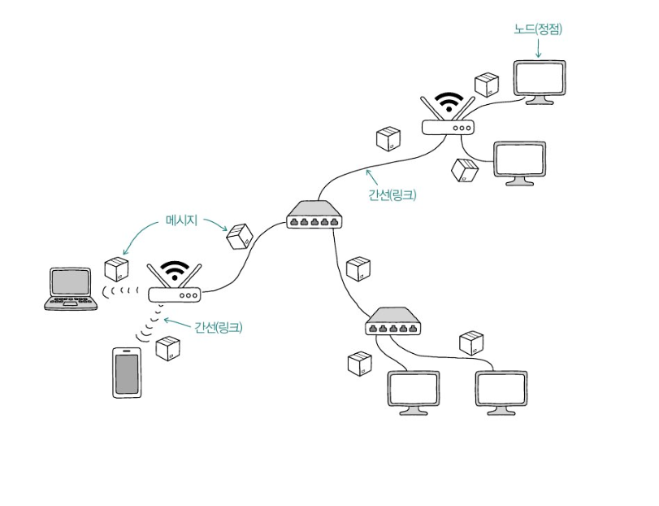

### 1) 네트워크의 기본 구조

- 네트워크는 `노드`와 `간선`으로 이루어진 자료구조 ⇒ 그래프의 형태를 띈다.
- 네트워크 토폴로지
  - 네트워크 상에서 노드와 노드 사이의 연결 구조
  - 어떻게 연결되고 배치되느냐에 따라 망형, 트리형, 링형 등의 유형으로 나눌 수 있다.

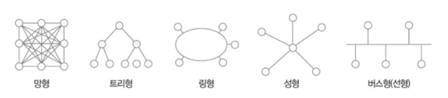

### 2) 호스트

- 네트워크의 가장자리에 위치
- 네트워크를 통해 주고받는 `정보를 최초로 송수신하는 노드`
- 우리가 흔히 접하는 대부분의 네트워크 기기가 호스트에 해당한다.

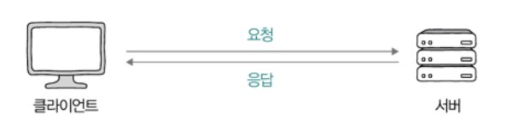

- `클라이언트`
  - `요청(request)`을 보내는 호스트
- `서버`

  - `응답(response)`을 보내는 호스트

  ⇒ 주고받는 정보의 방향에 따라 부여된 역할이다.

- 중간노드
  - 중간에 위치한 노드
  - 가장자리에 위치한 호스트가 주고받는 정보들을 원하는 수신지까지 안정적으로 전송하는 역할
  - 스위치, 라우터, 공유기 등이 해당된다.

### 3) LAN과 WAN

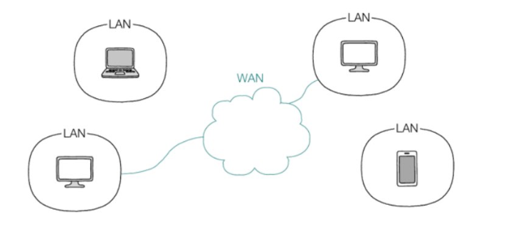

- 네트워크의 규모에 따라 여러 개의 네트워크로 나뉠 수 있다.
  ⇒ LAN 과 WAN 으로 나뉜다.
- `LAN (Local Area Network)`
  - `근거리` 네트워크
  - 가정이나 기업처럼 비교적 가까운 거리를 연결하는 `한정된 공간에서의 네트워크`를 말한다.
    - 집이나 사무실에 있는 공유기를 통해 네트워크 기기가 통신하고 있다면, LAN이 공유기를 기준으로 구축되었다고 볼 수 있다.
    - 해당 공유기와 연결된 네트워크 기기들은 모두 같은 네트워크(LAN)에 속해 있다고 인식한다.
- `WAN (Wide Area Network)`
  - `원거리` 네트워크
  - `LAN 간의 통신`을 의미한다.
  - 인터넷을 가능하게 만드는 네트워크이다.
  - 일반적으로 ISP(Internet Service Provider) 라고 하는 `인터넷 서비스 업체가 구축하고 관리`한다.
    - 예) SK 브로드밴드, KT, LG 유플러스

### 4) 패킷 교환 네트워크

- 네트워크를 통해 주고받는 데이터는 한 번에 송수신되지 않고, 여러 데이터로 쪼개져서 송수신된다.
- `패킷 (packet)`
  - **네트워크를 통해 송수신되는 데이터의 단위**
  - 오늘날의 네트워크는 패킷 단위로 주고받는 정보를 쪼개서 송수신하고 수신지에서 재조립하며 패킷을 주고받는 `패킷 교환 네트워크` 가 대부분이다.
  - `페이로드` 와 `헤더` 로 구성되어 있다.
    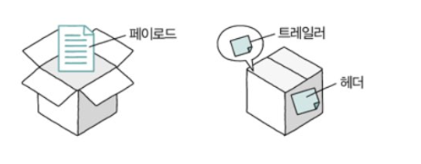
    - 가끔 트레일러 라는 정보가 포함되기도 한다.
    - `페이로드`
      - 패킷에서 송수신하고자 하는 데이터
    - `헤더`와 `트레일러`
      - 패킷에 추가되는 부가 정보

### 5) 주소의 개념과 전송 방식

- 주소
  - 패킷의 헤더에 명시되는 정보
  - 네트워크 상의 두 호스트가 패킷을 주고받기 위해 서로를 특정할 수 있는 정보
  - 대표적인 주소로 `IP` 와 `MAC` 주소가 있다.
  - 주소를 바탕으로 다양한 수신지 유형을 지정해 패킷을 보낼 수 있다.

### 6) 유니캐스트와 브로드캐스트

- 가장 자주 언급된다.

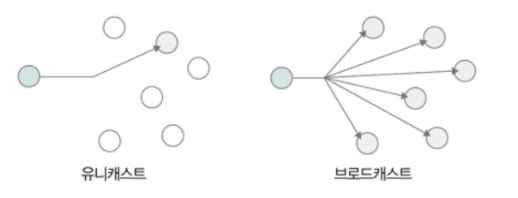

- `유니캐스트`
  - 송신지와 수신지가 일대일로 메시지를 주고받는 전송 방식
- `브로드캐스트`
  - 네트워크 상의 모든 호스트에게 메시지를 전송하는 전송 방식
    - 브로드캐스트 도메인 : 브로드캐스트가 전송되는 범위
    - 호스트가 같은 브로드캐스트 도메인에 속해 있는 경우에 같은 LAN에 속해 있다고 간주한다.
- 멀티캐스트와 애니캐스트
  - 멀티캐스트
    - 네트워크 내의 동일 그룹에 속한 호스트에게만 전송
  - 애니캐스트
    - 네트워크 내의 동일 그룹에 속한 호스트 중 가장 가까운 호스트에게 전송

## 1-2. 두 호스트가 패킷을 주고받는 과정

### 1) `프로토콜`

- 호스트가 서로 주고받는 정보를 이해하기 위한 규칙
- 네트워크에서 통신을 주고받는 노드 간의 합의된 규칙이나 방법
  - 패킷을 주고받는 호스트와 네트워크 장비들이 서로 주고받는 정보를 이해하려면 같은 프로토콜을 이해해야하고, 같은 프로토콜로 통신해야 한다.
    ⇒ 네트워크의 언어와 같다고 표현
- 종류가 매우 다양하다.

  - 예) IP, ARP, HTTP, TCP, UDP, …

- 프로토콜마다 `목적` 과 `특징` 이 다르다.
  ⇒ 프로토콜의 헤더를 분석해보는 것이 각 프로토콜의 목적과 특징을 이해하기 좋다.
  - `IP`
    - 네트워크 간의 주소를 지정하는 프로토콜
  - `ARP`
    - IP 주소와 MAC 주소를 대응시키는 프로토콜
  - `HTTPS`
    - 보안상 HTTP에 비해 안전한 프로토콜
  - `TCP`
    - UDP 에 비해 신뢰성이 높은 프로토콜

### 2) 네트워크 참조 모델

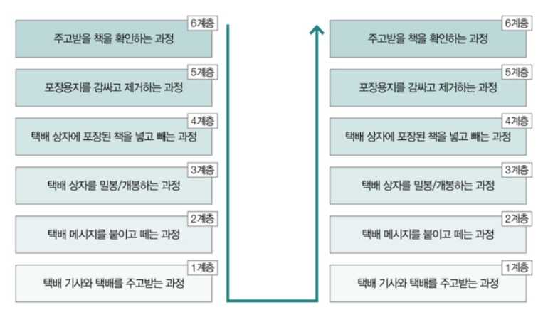

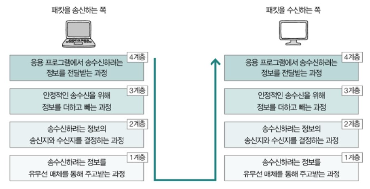

- 네트워크 참조 모델
  - 통신이 이루어지는 단계를 계층적으로 표현한 것
- 패킷을 송신하는 쪽
  - 상위 계층 → 하위 계층으로 정보를 보낸다.
- 패킷을 수신하는 쪽
  - 하위 계층 → 상위 계층으로 정보를 받아들인다.

### 3) `OSI 모델`

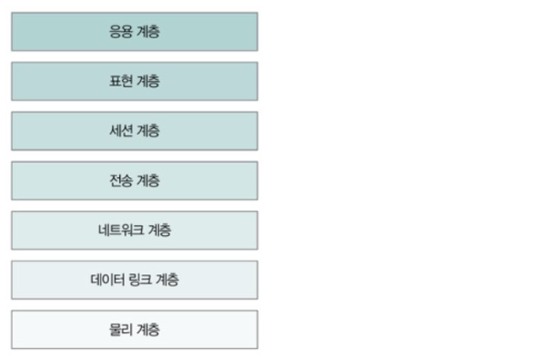

- 국제 표준화 기구에서 만든 네트워크 참조 모델
  - 통신 단계를 7개의 계층으로 나눠 OSI 7계층이라고 부른다.
    - 물리 계층, 데이터 링크 계층, 네트워크 계층, 전송 계층, 세션 계층, 표현 계층, 응용 계층으로 구성되어 있다.

1. `물리 계층`
   - 가장 최하위 계층
   - `비트 신호`를 주고받는 계층
   - 유무선 통신 매체를 통해 운반하는 계층
2. `데이터 링크 계층`
   - 같은 LAN에 속한 호스트끼리 올바르게 정보를 주고받기 위한 계층
   - 같은 네트워크에 속한 호스트를 식별할 수 있는 주소 `(MAC 주소)를 사용` 한다.
   - 물리 계층을 통해 주고받는 정보에 오류가 없는지 확인한다.
     - 하드웨어와 밀접하게 맞닿아 있는 계층이다.
3. `네트워크 계층`
   - `네트워크 간 통신을 가능`하게 하는 계층이다.
   - LAN을 넘어 `다른 네트워크와 통신을 주고받기 위해 필요한 계층`이다.
   - 호스트를 식별할 수 있는 주소(`IP 주소`)가 필요하다.
     - 네트워크 계층에서 대표적으로 사용되는 프로토콜이 IP이다.
4. 전송 계층
   - 송수신되는 패킷은 전송 도중에 유실될 때도 있고, 순서가 뒤바뀔 때도 있다.
     - 이러한 상황을 대비해 `신뢰성` 있는 전송을 가능하게 하는 계층이다.
   - `포트`
     - 포트정보를 통해 특정 응용 프로그램과의 `연결 다리 역할`을 수행하는 계층이다.
       - 대표적인 프로토콜 : TCP, UDP
5. 세션 계층
   - 세션
     - 응용 프로그램 간의 연결 상태를 의미
   - 세션을 관리하기 위한 계층
   - 응용 프로그램 간의 연결 상태를 유지하거나 새롭게 생성하고, 필요하다면 연결을 끊는 역할을 한다.
6. 표현 계층
   - 인코딩, 압축, 암호화와 같은 작업을 수행한다.
   - 세션 계층과 표현 계층은 다른 계층과 달리, 두 계층을 명확하게 구분하지 않거나 응용 계층에 포함하여 간주하는 경우가 많다.
7. 응용 계층
   - `사용자와 가장 밀접`하게 맞닿아 있어 여러 네트워크 서비스를 제공하는 계층
   - 중요한 프로토콜들이 다수 포함되어 있다.
     - HTTP, HTTPS, DNS 등

### 4) TCP / IP 모델

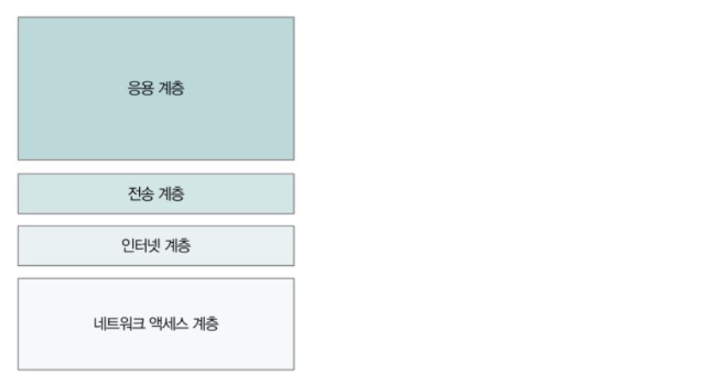

- 구현과 프로토콜에 중점을 둔 네트워크 참조 모델
- 네트워크 액세스 계층, 인터넷 계층, 전송 계층, 응용 계층으로 구성
  - 네트워크 액세스 계층
    - OSI 모델의 데이터 링크 계층과 유사
  - 인터넷 계층
    - OSI 모델의 네트워크 계층과 유사
  - 전송 계층
    - OSI 모델의 전송 계층과 유사
  - 응용 계층
    - OSI 모델의 세션 계층, 표현 계층, 응용 계층을 합친 것과 유사

### 5) 캡슐화와 역캡슐화

- 송신 과정 ⇒ 캡슐화
- 수신 과정 ⇒ 역캡슐화

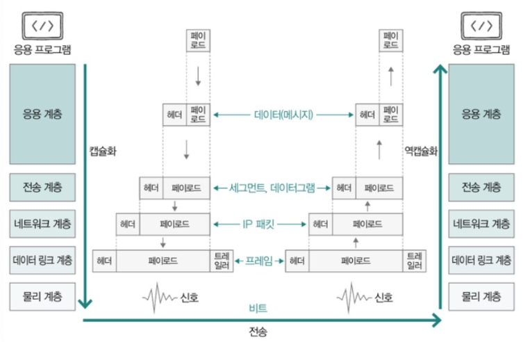

- 캡슐화
  - 송신 과정에서 헤더(및 트레일러)를 추가해 나가는 과정을 의미
- 역캡슐화
  - 캡슐화 과정에서 붙인 헤더(및 트레일러)를 각 계층에서 확인한 뒤 제거하는 과정
  - 유의할 점!
    - 각 계층에서 주고받는 패킷(메시지)을 지칭하는 이름이 다르다.
      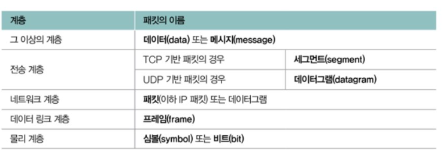

## 1-3. 네트워크 지도 그리기

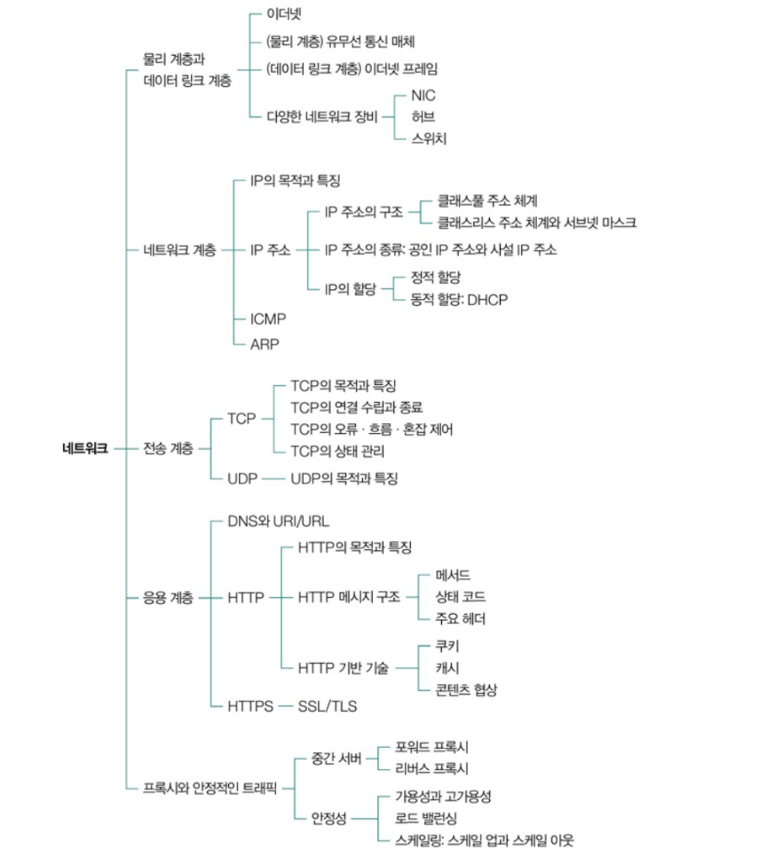
