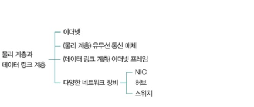
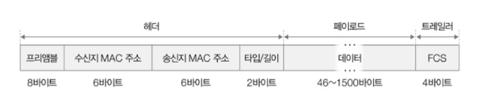
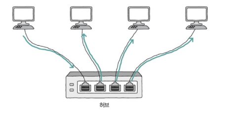

# Chap 2. 물리 계층과 데이터 링크 계층

## 1. 이더넷이란?

- `LAN(Local Area Network)`에서 가장 널리 쓰이는 기술
  - LAN 내의 호스트들이 올바르게 정보를 주고받을 수 있게 해주는 다양한 기술 중 대표적인 예시
- **`IEEE 802.3 표준`**
- **데이터 링크 계층 + 물리 계층** 모두 포함
- **프레임(Frame) 단위**로 데이터 전송

### 1. 이더넷 표준

- 개발자 입장에서 특정 이더넷 표준을 자세히 볼 필요는 없지만, 다음 2가지 상황은 기억해두는 것이 좋다.
  1. 오늘날의 (유선)LAN `대부분이 이더넷 표준을 따르`기 때문에 대다수의 LAN 장비들이 특정 이더넷 표준을 따른다.
     - 케이블, 허브, 스위치, NIC 등 다양한 네트워크 장비들 모두 특정 이더넷 표준을 이해하고 따른다고 봐도 무방하다.
  2. 이더넷 표준이 달라지면 통신 매체의 종류를 비롯한 신호 송수신 방법, 나아가 최대 지원 속도도 달라질 수 있다.
     - 최신 이더넷 표준을 준수하는 네트워크 장비는 일반적으로 최대 지원 속도가 빠른 경우가 많다.

### 2. 이더넷 프레임

- 이더넷 기반의 네트워크에서 주고받는 프레임
- Ethernet II
  - 오늘날 주로 사용되는 이더넷 프레임
- 이더넷(IEEE 802.3 표준)에서는 `헤더`, `데이터`, `트레일러`로 구성된 고정된 구조를 따른다.

### **3. 이더넷 프레임 구조**

1. **`프리앰블 (Preamble)`**
   - `송수신지 동기화`를 위해 사용되는 `8바이트(64비트) 크기`의 정보
   - 프리앰블의 첫 7바이트는 10101010 이라는 값을 가지고, 마지막 바이트는 10101011 이라는 값을 가진다.
   - 수신지 입장에서는 이 프리앰블 비트를 통해 현재의 이더넷 프레임이 수신되고 있다는 사실을 알 수 있다.
2. **`송수신지 MAC 주소`**

   - 프레임에서 가장 중요한 정보
   - 송신지와 수신지를 특정할 수 있는 6바이트(48비트) 길이의 MAC 주소가 명시된다.
   - `콜론(:) 으로 구분된 12자리 16진수`로 구성되어 있다
       <aside>
       
       **ab : cd : ab : cd : 00 : 01**
       
       </aside>

   - `MAC 주소`
     - 물리적 주소
     - `네트워크 인터페이스마다 하나씩 부여`되는 주소이다.
       - 네트워크 인터페이스란? 네트워크를 향하는 통로, 연결 매체와의 연결 지점을 의미한다.
         - 보통 NIC라는 장치가 네트워크 인터페이스를 담당한다.
         - 네트워크 인터페이스가 여러 개 → 한 호스트가 여러 개의 MAC 주소를 가질 수 있다.

3. **`타입/길이`**
   - 해당 필드에 명시된 크기가
     - 1500 ↓ (16진수 05DC)이면, `프레임의 크기`를 나타낸다.
     - 1536 ↑ (16진수 0600)이면, `타입`을 나타낸다.
       - 타입을 통해서 캡슐화된 상위 계층의 프로토콜 정보를 알 수 있다.
         - 16진수 0800 ⇒ IP (IPv4)
         - 16진수 0806 ⇒ ARP
4. **`데이터`**
   - 페이로드
     - 상위 계층으로 전달하거나 전달받을 데이터가 명시된다.
   - 단, 데이터 필드에 포함될 수 있는 `데이터의 최대 크기가 정해져 있다.`
     - 최대 크기 : 일반적으로 1500바이트 이하로 제한
       - 이보다 큰 데이터를 보낼 경우, 여러 패킷으로 나뉘어 보내진다.
   - 1500 바이트
     - 이더넷 프레임으로 전송 가능한 최대 데이터의 크기
     - 네트워크 계층 패킷(헤더 + 페이로드)의 최대 크기 → MTU
       - 더 큰 데이터를 포함할 수 있는 특별한 프레임 → jumbo frame
5. **`FCS`**
   - 트레일러로, 프레임의 오류가 있는지 여부를 확인하기 위한 필드이다.
     - CRC(Cyclic Redundancy Check) 라는 오류 검출용 값이 명시된다.
     - 송신지에서 전송할 데이터와 전송할 데이터에 대한 CRC 값을 수신지에서 대조해보고 두 값이 같을 경우 프레임에 오류가 없다고 판단한다.

## 2. 유선 통신 매체

### **1. 유선 매체 - 트위스티드 페어 케이블 (Twisted Pair Cable)**

- `두 가닥`의 절연 구리선을 서로 꼬아 만든 케이블
- 구리선을 통해 `전기적으로 신호`를 주고받는 통신 매체
- **잡음과 누화(crosstalk)** 방지에 효과적
- 종류:
  - UTP (Unshielded Twisted Pair): 차폐막 없음, 가격 저렴, 설치 간편
    - 차폐란? 구리선 주변을 보호해 노이즈를 감소시키는 방식
  - STP (Shielded Twisted Pair): 차폐막 있음, 전자기 간섭에 강함
- 주로 **LAN 환경에서 이더넷** 연결에 사용
- 전송 속도: 10Mbps ~ 10Gbps 이상

### **2. 동축 케이블 (Coaxial Cable)**

- 중심 도체(core), 절연체, 도체망(shield), 외피로 구성
- `높은 전자기 간섭 차단 효과`
- 과거 이더넷(10Base-2, 10Base-5)에 사용되었으나 현재는 거의 사용하지 않음
- 여전히 **케이블 TV, CCTV** 등에서 사용 중

### **3. 광섬유 케이블 (Optical Fiber Cable)**

- `빛`을 이용해 데이터를 전송하는 매체
- 구성: 중심 유리 코어, 클래딩(굴절), 보호 코팅
- 장점:
  - 매우 빠른 전송 속도 (Tbps 이상)
  - 장거리 전송에 적합
  - 전자기 간섭 없음
- 단점: 가격이 비싸고 설치가 어려움
- 종류:
  - 단일 모드(SMF, Single Mode Fiber): 긴 거리, 고속 통신
  - 다중 모드(MMF, Multi Mode Fiber): 짧은 거리, 저렴
- **비교 정리**

| 매체    | 속도      | 거리       | 전자기 간섭 | 비용 | 사용 예    |
| ------- | --------- | ---------- | ----------- | ---- | ---------- |
| UTP     | 중        | 중 (~100m) | 약함        | 저렴 | 이더넷     |
| STP     | 중        | 중 (~100m) | 강함        | 보통 | 산업용 LAN |
| Coaxial | 중        | 중 (~500m) | 강함        | 보통 | CCTV, 방송 |
| Optical | 매우 빠름 | 매우 길다  | 없음        | 고가 | 통신 백본  |

## 3. 무선 통신 매체

1. **무선 LAN (Wi-Fi, Wireless LAN)**
   - IEEE 802.11 시리즈 (예: 802.11n, 802.11ac 등)
   - 2.4GHz 또는 5GHz 주파수 대역 사용
   - 장점: 설치 편리, 이동성
   - 단점: 보안 위협, 간섭 가능성
   - AP(Access Point)를 중심으로 여러 장치가 연결됨
2. **블루투스 (Bluetooth)**
   - 저전력, 근거리 무선 통신 기술 (약 10m 내외)
   - 무선 키보드, 이어폰, IoT 기기 등에서 사용
   - 주파수: 2.4GHz ISM 대역
   - 단일 마스터 - 다수 슬레이브 구조
3. **적외선 (Infrared, IR)**
   - TV 리모컨 등에서 사용되는 근거리 통신
   - 장점: 전력 소비 적음
   - 단점: 직선 통신 필요, 장애물에 약함
4. **NFC (Near Field Communication)**
   - 10cm 이내에서 작동하는 무선 통신 기술
   - 스마트폰 간 파일 전송, 교통카드, 모바일 결제 등에 사용
   - 매우 낮은 대역폭
5. **무선 통신의 특성 및 한계**
   - 전파 간섭, 거리 제한, 보안 취약성 고려 필요
   - 암호화 및 인증 기술을 통해 보안 강화 필요

## 4. 네트워크 인터페이스: NIC

- **네트워크 인터페이스 카드**
- 컴퓨터를 네트워크에 **물리적으로 연결해주는 장치**

### 1. 주요 기능

- **MAC 주소** 보유: 각 NIC는 고유한 `48비트 MAC 주소`를 가짐
- **프레임 송수신**: 이더넷 프레임을 송신하고 수신
- **전기/전자 신호 변환**: 디지털 데이터를 물리 계층의 신호로 변환하고, 그 반대 수행
- **에러 검출**: 수신된 프레임의 `FCS(Frame Check Sequence)`를 통해 오류 검출

## 5. 허브와 스위치

### 1. 물리 계층의 허브

- `허브`
  - 물리 계층의 대표적인 네트워크 장비
  - 여러 대의 호스트를 연결하는 장치
  - 리피터 허브 or 이더넷 허브 라고 부르기도 한다.
- 포트
  - 허브에서 케이블의 커넥터가 꽂히는 부분
  - 통신 매체를 연결하는 지점

### 2. 허브

- 중요한 특징 2가지
  - `들어온 신호를 모든 포트로 그대로 전송`
    - 신호를 전달받으면 해당 신호에 대한 어떠한 조작이나 판단도 하지 않고, 모든 포트에 단순하게 신호를 내보낸다.
  - `반이중 모드`로 통신
    
    - 반이중 통신이란?
      - 반이중 모드로 송수신하는 것을 말한다.
      - 반이중 모드 : 송신 또는 수신을 번갈아 가면서 수행해야 하는 동작 방식
        - `동시 송수신`이 `불가능`하다.
          - 예) 무전기 - 어느 한 쪽이 송신할 때 다른 쪽은 송신이 불가능하다.

### 3. 데이터 링크 계층의 스위치

- **데이터 링크 계층(2계층)** 장비
- 수신된 프레임의 `목적지 MAC 주소를 분석`하여 `정확한 포트로만 전달` (유니캐스트)

**주요 기능**

- **MAC 주소 테이블(MAC Address Table)** 유지
  → 어떤 MAC 주소가 어느 포트에 있는지 저장
- `충돌 도메인 분리 가능`
  → 각 포트가 독립된 충돌 도메인이 되어 충돌 방지
- `전이중(full-duplex) 통신` 지원 → 성능 우수

**장점**

- 허브보다 효율적이고, 네트워크 트래픽 감소
- **브로드캐스트**, **멀티캐스트**, **유니캐스트** 모두 지원
