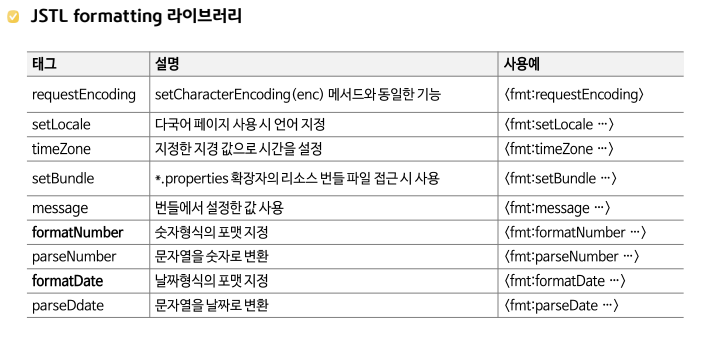
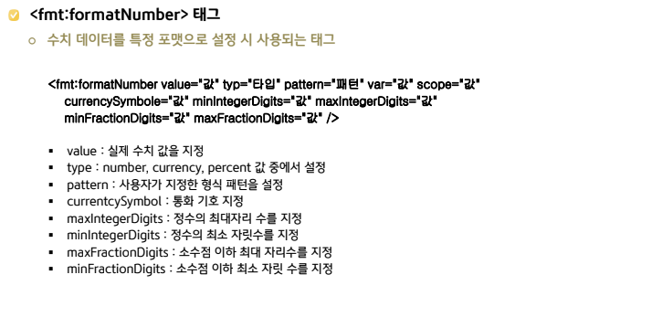
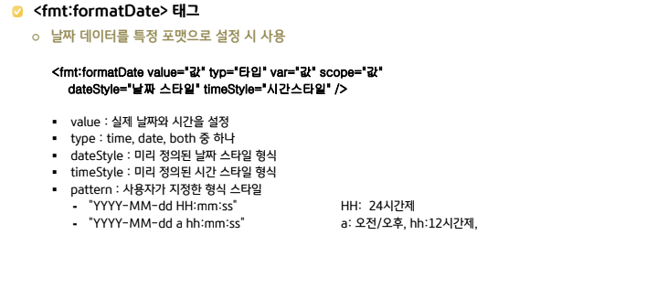

# JSTL

- 6월 1주차 수업 리뷰

<br/>

# JSTL

- `JavaServerPages(JSP) Standard Tag Library`
  - 액션 태그를 사용자가 직접 제작 OK → 커스텀 태그
    - 커스텀 태그들 중에서 자주 사용되는 태그들을 묶어서 아파치 그룹에서 제공하는 것을 말한다.
- JSP 페이지 내에서 `자바 코드를 최소화`하고, 로직을 태그 형태로 처리할 수 있게 해주는 표준 태그 라이브러리
- JSP `가독성을 높이고 유지보수가 쉬운 구조`로 만들 수 있다.
  - EL과 함께 사용한다.

<br/>

## JSTL의 주요 목적

- 자바 코드를 줄이고 `HTML`과 `JSP 태그 중심의 코딩`을 가능하게 한다.
- `로직 분리`를 통해 `MVC 패턴의 View 역할에 충실`한 JSP 페이지 작성이 가능하다.
- 조건문, 반복문, 포맷팅, 데이터 출력 등 다양한 기능을 태그로 지원한다.

<br/>

## JSTL 라이브러리 설정

- mvnrepository 에서 jstl 검색해서 다운로드
- taglibs 설치 후 C:\apache-tomcat-9.0.89\lib 에 파일 배치 → 모든 프로젝트에 적용
  - JSP가 JSTL 태그를 인식할 수 있게 하기 위함
  - `JSTL 태그`는 `JSP 표준 태그가 아니기` 때문에 필요한 작업

<br/>

### JSP 상단에 태그 선언

```java
<%@ taglib prefix="c" uri="http://java.sun.com/jsp/jstl/core" %>
```

- `prefix="c"`: 이 페이지에서 JSTL Core 태그를 사용할 때 `c:`라는 접두어를 쓰겠다는 의미
- `uri="..."`: 해당 URI에 연결된 태그 라이브러리를 참조하겠다는 뜻 (실제 파일 경로가 아님 — TLD(Tag Library Descriptor, 태그 정의 정보)와 매핑됨)

<br/>
<br/>

## JSTL 주요 라이브러리

| 라이브러리      | Prefix | URI                                      | 기능                                      |
| --------------- | ------ | ---------------------------------------- | ----------------------------------------- |
| Core            | `c`    | `http://java.sun.com/jsp/jstl/core`      | 조건문, 반복문, 변수 처리 등              |
| I18N formatting | `fmt`  | `http://java.sun.com/jsp/jstl/fmt`       | 날짜, 숫자 포맷, 로케일 설정 등           |
| Functions       | `fn`   | `http://java.sun.com/jsp/jstl/functions` | 문자열 처리 관련 유틸리티 함수 사용 OK    |
| SQL             | `sql`  | `http://java.sun.com/jsp/jstl/sql`       | DB 연결 및 쿼리 실행 (테스트 용도에 적합) |
| XML processing  | `x`    | `http://java.sun.com/jsp/jstl/xml`       | XML 데이터 파싱 및 출력                   |

<br/>

## JSTL Core 라이브러리

- 기본적이고 핵심적인 기능들을 구현해 놓은 라이브러리
- 문자열 출력, if문, for문과 같은 제어문 기능 포함

### 1. 변수 설정

```java
// JSP의 setAttribute(name, key) 기능과 동일
<c:set var="name" value="김철수" />    // scope에 따른 바인딩 처리 가능
```

### 2. 출력

```java
<p>사용자 이름: <c:out value="${username}" /></p>    // 지정된 값을 출력할 때 사용
```

### 3. 조건문

- else문은 없다.

```java
// 조건 처리를 사용할 때 사용
<c:if test="${score >= 90}">
  <p>우수</p>
</c:if>
```

### 4. 다중 조건문

```java
<c:choose>    // 자바의 switch문과 비슷
  <c:when test="${score >= 90}">우수</c:when> // choose의 서브태그,조건이 만족된 경우 사용
  <c:when test="${score >= 70}">보통</c:when>
  <c:otherwise>미달</c:otherwise>    // choose의 서브태그,조건을 만족하지 못한 경우
</c:choose>
```

### 5. 반복문

```java
// 반복 처리를 하고자 할 때 사용
<c:forEach var="item" items="${itemList}">
  <li>${item}</li>
</c:forEach>
```

### 6. 지정된 scope에 설정한 변수 값 제거

```java
<c:remove var="변수명" scope="scope값"/>
```

<br/>

## JSTL formatting 라이브러리

- 국제화/지역화 및 데이터 포맷과 관련된 기능 제공
- 국제화/지역화 → 다국어 처리
- 데이터 포맷 → 날짜와 숫자와 관련된 기능

<br/>



<br/>



<br/>


