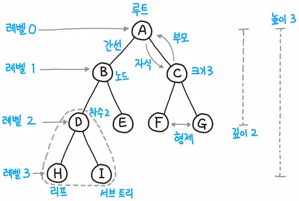

# tree 구조

### 1. 트리란?

- 트리는 **계층적(Hierarchical)** 구조를 표현할 수 있는 **비선형 자료구조.**
- 노드(Node)와 간선(Edge)으로 구성되며, **사이클이 없는 연결 그래프이다.**
- \*루트 노드(Root Node)\*\*를 기준으로 하위 노드들이 뻗어나가는 구조입니다.

---

### 2. 트리의 기본 용어



(출처: [https://velog.io/@stresszero/tree](https://velog.io/@stresszero/tree))

| 용어              | 설명                                      |
| ----------------- | ----------------------------------------- |
| **노드(Node)**    | 트리의 각 요소. 데이터와 자식 노드를 포함 |
| **루트(Root)**    | 트리의 시작점이 되는 노드                 |
| **부모(Parent)**  | 현재 노드의 상위 노드                     |
| **자식(Child)**   | 현재 노드의 하위 노드                     |
| **형제(Sibling)** | 같은 부모를 가진 노드                     |
| **리프(Leaf)**    | 자식이 없는 노드 (말단 노드)              |
| **간선(Edge)**    | 노드와 노드를 연결하는 선                 |
| **레벨(Level)**   | 루트부터 거리 (루트는 0 또는 1로 시작)    |
| **깊이(Depth)**   | 특정 노드가 루트로부터 얼마나 깊은지      |
| **높이(Height)**  | 노드로부터 가장 먼 리프까지의 거리        |

---

### 3. 트리의 특징

- **사이클이 없음(중요한 특징)**
- **연결 그래프**이며, N개의 노드는 N-1개의 간선을 가짐(root 노드는 상위로의 간선이 없음)
- **계층 구조 표현에 적합**

---

### 4. 트리의 종류

### 📌 일반 트리(General Tree)

- 자식 노드의 수가 제한되지 않음

### 📌 이진 트리(Binary Tree)

- 모든 노드가 **최대 2개의 자식**을 가짐
- 종류:
  - **포화 이진 트리**: 모든 레벨이 노드로 꽉 참
  - **완전 이진 트리**: 마지막 레벨을 제외하고 꽉 차 있으며, 마지막 레벨은 왼쪽부터 채워짐
  - **정 이진 트리**: 모든 노드가 자식 0개 또는 2개만 가짐

### 📌 이진 탐색 트리(Binary Search Tree, BST)

- 왼쪽 자식 < 부모 < 오른쪽 자식
- 탐색, 삽입, 삭제에 효율적 (평균 시간복잡도 O(log n))

---

### 5. 트리 구현 방식(자바 기반)

- 배열 기반(이진 트리)
- 인덱스 기반 자식 접근 가능
  - 최상위 루트 노드를 0으로 설정
  - 왼쪽 자식: 2\*i+1
  - 오른쪽 자식: 2\*i+2

---

### 6. 트리 순회(Tree Traversal)

### 👉 전위 순회 (Preorder): Root → Left → Right

### 👉 중위 순회 (Inorder): Left → Root → Right

### 👉 후위 순회 (Postorder): Left → Right → Root

### 👉 레벨 순회 (Level Order): BFS 사용

---

### 7. 이진 트리 예시

```

       1
      / \
     2   3
    / \   \
   4   5   6

```

- 전위 순회: 1-2-4-5-3-6
- 중위 순회: 4-2-5-1-3-6
- 후위 순회: 4-5-2-6-3-1

---

### ❓ 트리에 사이클이 없어야 하는 이유

### 🔹 1. 트리의 정의 자체가 "사이클이 없는 연결 그래프"

- 트리는 **N개의 노드가 있고 N-1개의 간선**으로 연결된 **사이클이 없는 연결 그래프이다.**

### 🔹 2. 트리는 "부모 → 자식"의 **단방향 관계**

- 트리에서 한 노드는 **단 하나의 부모만 가질 수 있어야** 함.
- 사이클이 생기면 하나의 노드가 **여러 부모**를 가지거나, **자기 자신을 자식으로 가지는 구조**도 가능해지기 때문에 트리의 **단일 계층 구조**를 위반하게 됩니다.

### 🔹 3. 트리 순회(Traversal)에서 무한 루프에 빠질 수 있음

- 전위/중위/후위 순회 같은 트리 순회 알고리즘은 "자식이 있으면 자식으로 내려간다"라는 방식인데,
  사이클이 있으면 무한히 같은 노드를 다시 방문하는 문제 발생.
